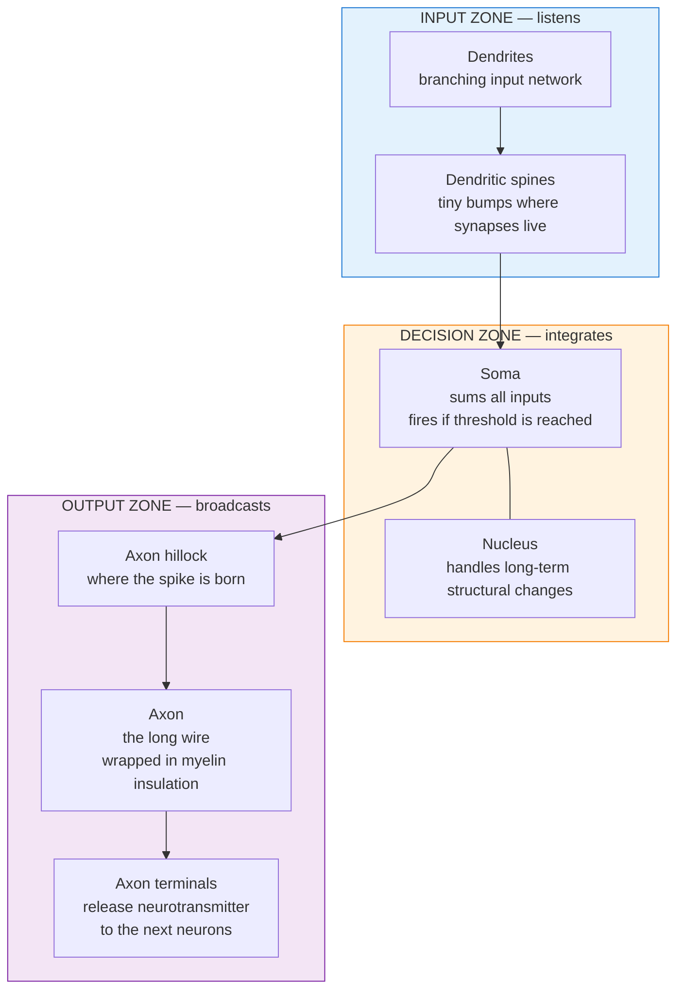
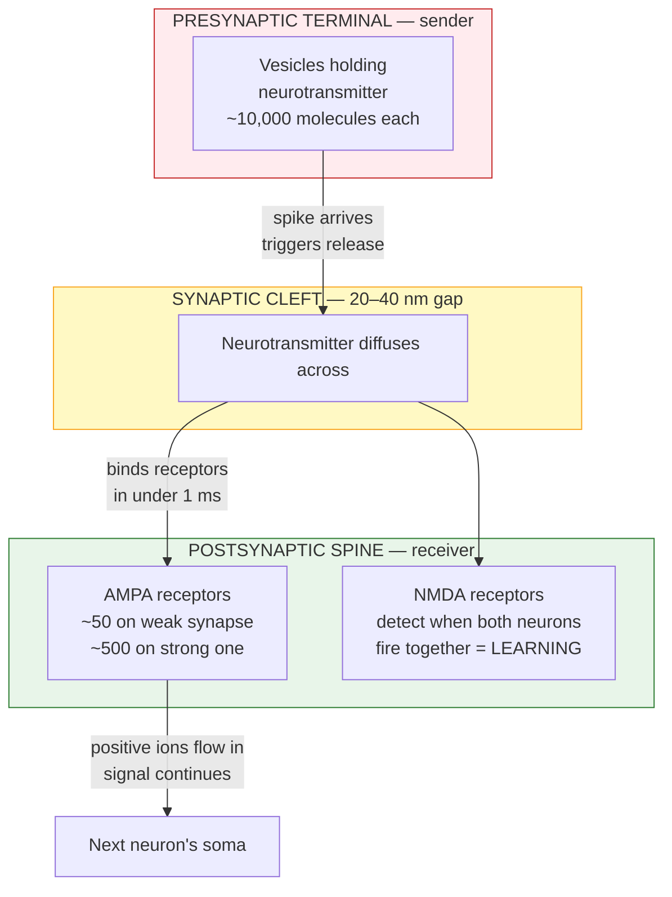

# Chapter 1: The Biological Neuron

*A single brain cell is not a simple switch. It's a small self-contained computer — built from molecules, running on chemistry, capable of learning. This chapter introduces its shape, its parts, and how a signal travels through it.*

---

## The brain's building blocks

Before we zoom in on a single neuron, a quick framing.

The brain is made of cells. Most of them fall into two categories:

- **Neurons** — the cells that do the signaling and the computing. Roughly 86 billion of them. These are what this guide is about.
- **Glia** — supporting cells that feed, insulate, clean up after, and protect neurons. Roughly as many as neurons, maybe slightly more. Important in real life, but we'll mostly set them aside here.

When neuroscientists talk about "how the brain works," they almost always mean **networks of neurons connected by synapses**. Neurons are the fundamental building blocks — the Lego pieces from which thought, memory, learning, emotion, and everything else you experience is built.

> **One brain** ≈ 86 billion neurons + 100 trillion synaptic connections between them.
> **One neuron** = the subject of this chapter.

Understand one neuron well, and the rest of the guide — how they communicate, how they learn, how intelligence emerges from their networks — builds naturally on top.

---

## What a neuron actually does

A neuron has one job: **receive signals from other neurons, decide whether to fire, and pass the decision along.**

That's it. Repeat this across 86 billion neurons connected by 100 trillion synapses, and you get everything from a heartbeat to a thought about Newton's second law.

The interesting part is *how* a single neuron does this job. The short version: it's a three-zone device. One zone listens. One zone decides. One zone broadcasts.

---

## The shape of a neuron

**Signal flow is one-way.** Dendrites receive. Soma decides. Axon transmits. Never the reverse. This one-way-ness is essential — it's how the brain maintains direction and coherence across billions of conversations happening at once.

Now each zone in more detail.

---

## Zone 1 — the input zone (listening)

Dendrites are branching, tree-like structures reaching outward from the cell body. Each neuron has roughly 5–7 main branches, each splitting into 10–20 smaller ones. Together they form a receiving network dense enough to pick up thousands of signals from thousands of other neurons at once.

Covering those dendrites are **dendritic spines** — tiny mushroom-shaped bumps, each one a potential learning site. When you learn something, specific spines physically grow larger. When you forget, they shrink or disappear entirely. A typical cortical neuron has 2,000–5,000 of them.

Concrete evidence that this matters in real life:
- **Musicians** have roughly 40% more spines in motor-cortex regions than non-musicians — the mark of years of specialized practice.
- **London taxi drivers**, famous for having to memorize the city's 25,000 streets, develop visibly larger hippocampi (the brain's memory encoder).

So every new skill or piece of knowledge you've ever learned — it lives on these tiny bumps, distributed across millions of neurons.

---

## Zone 2 — the decision zone (deciding)

This is where arithmetic happens.

In any given millisecond, thousands of signals arrive through the dendrites. Most are "yes" votes (pushing the neuron toward firing). Some are "no" votes. The **soma** — the cell body — sums them all, literally adding positive and negative voltages together, and checks a single threshold:

> **If the total voltage crosses –55 millivolts, the neuron fires.**
> Otherwise, it stays silent and waits for more input.

That's the entire decision. Fire or don't fire. A 2-millisecond electrical spike travels down the axon, or nothing happens.

Sitting inside the soma is the **nucleus** — the cell's DNA-containing control center. One important clarification: the nucleus is *not* where real-time decisions happen. That's the soma's membrane, working on a millisecond timescale. The nucleus handles the much slower work — gene expression and protein synthesis for long-term structural changes, operating on a timescale of hours to days. This distinction matters for understanding learning (and is revisited in [Chapter 4](04-learning-mechanisms.md)).

---

## Zone 3 — the output zone (broadcasting)

Once the soma decides to fire, the spike has to travel. The output zone is built for speed.

The spike starts at the **axon hillock**, a small junction between the soma and the axon. The hillock has the lowest firing threshold and the highest density of voltage-gated sodium channels in the whole neuron — which is why spikes reliably ignite there first.

From the hillock, the spike travels down the **axon**, a single long fiber. Axons can be microscopic (a local connection within the cortex) or over a meter long (a motor neuron reaching from your spinal cord to your toe). Remarkably, the spike regenerates itself at every point along the axon, so it arrives at the far end at full strength.

Most long axons are wrapped in **myelin**, a fatty insulation that dramatically speeds things up. Without myelin, a signal across your 15 cm cortex would take 150–300 milliseconds. With myelin, 2–8 milliseconds. It's the difference between thinking in real time and not. (This is also why multiple sclerosis, which destroys myelin, is so debilitating.)

At the end of the axon sit **axon terminals** — tiny "post offices" where the signal hands off to the next neuron. A single neuron can have thousands of these terminals, reaching thousands of other neurons. This is how one decision becomes many.

---

## Zoom in: the synapse

When the signal reaches a terminal, it has to cross a tiny gap to reach the next neuron. That gap is called a **synapse**, and it's where most of the interesting drama in the brain happens.

The gap is 20–40 nanometers wide — so small you could fit hundreds of them across the width of a human hair. Yet that gap is the single most important feature of biological intelligence.

**Why a gap matters:** if neurons were hardwired electrically, connection strengths would be fixed forever. Because there's a chemical gap, and because the number of receptors on the receiving side can change, **connections can strengthen or weaken with experience.** That is learning, at its physical root.

A weak synapse might have 50 AMPA receptors. A strong, well-learned synapse can have 500 — a 10× range built entirely through experience. Full mechanism in [Chapter 3](03-synaptic-transmission.md).

---

## The complete signal flow in six steps

Here's what happens when a signal travels through one neuron, beginning to end:

1. **Neurotransmitter arrives** at a dendritic spine, released by the previous neuron.
2. **Receptors open** — positive ions flow in, creating a small voltage bump at the spine.
3. **Bumps sum at the soma.** Excitatory bumps add up. Inhibitory bumps subtract.
4. **Threshold check** — if the total crosses –55 mV, the axon hillock ignites.
5. **Spike races down the axon** — jumping between nodes in the myelin, reaching terminals in milliseconds.
6. **Release at terminals** — calcium rushes in, vesicles fuse, neurotransmitter spills across the gap. The next neuron begins its own version of step 1.

One full cycle: about 1–2 milliseconds.
One thought: millions of these cycles happening simultaneously across many neurons.

---

## Supporting infrastructure

Beyond the three zones, a neuron has parts that keep everything running but don't carry signal directly. These come up throughout the guide:

- **Ion channels** — molecular gates that let specific ions flow. They decide when a neuron fires.
- **Neurotransmitters** — chemical messengers. Glutamate excites (80% of synapses). GABA inhibits (15%). Modulators like dopamine tune the system (<1%).
- **Receptors** — lock-and-key proteins that catch neurotransmitters. AMPA and NMDA are the two you'll hear about most.
- **Mitochondria** — cellular power plants. The brain uses roughly 20% of your body's energy despite being only 2% of its weight.
- **Cytoskeleton and motor proteins** — internal scaffolding plus a delivery system for proteins. Essential for spine growth during learning.

Each of these deserves a chapter of its own. This one gives you the map; later chapters fill in the details.

---

## Quick-reference numbers

For readers who want specifics, here's everything in one table. Skip if you don't care.

| Quantity | Value |
|----------|-------|
| Total neurons in the brain | ~86 billion |
| Total synapses | ~100 trillion |
| Resting voltage of a neuron | −70 mV |
| Firing threshold | −55 mV |
| Peak of a firing spike | +40 mV |
| Duration of one spike | 1–2 ms |
| Typical firing rate | 5–50 Hz (max ~1000 Hz) |
| Spike speed, myelinated axon | 10–120 m/s |
| Spike speed, unmyelinated axon | 0.5–2 m/s |
| Synaptic gap width | 20–40 nanometers |
| Neurotransmitter molecules per vesicle | 5,000–10,000 |
| AMPA receptors on a weak synapse | ~50 |
| AMPA receptors on a strong synapse | ~500 |
| Spines per typical cortical neuron | 2,000–5,000 |
| Brain's energy usage | ~20 W (20% of body total) |

---

## Key takeaway

> A neuron is a small computer with a listening zone, a deciding zone, and a broadcasting zone. It runs on ion gradients, receives signals as chemicals, transmits them as electricity, and translates back to chemicals at each gap.
>
> Everything about how you think, feel, and learn — from recognizing a face to solving a physics problem — is this process, happening billions of times per second across trillions of connections.
>
> Most importantly: **your knowledge is not stored *in* the brain. It *is* the brain.** It's the physical pattern of which synapses are strong, which spines have grown, which connections have formed. Change the pattern, and you've changed yourself.
