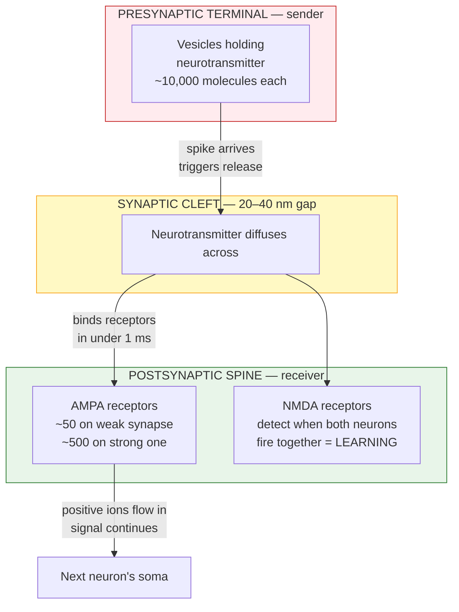

# Chapter 1: Inside a Single Brain Cell

*The single building block of every thought you've ever had.*

---

## What just happened in your head

Right now, as your eyes move across this sentence, billions of tiny decisions are happening inside your skull.

Photons bounce off the screen and hit your retina. Patterns get matched. Letters become words. Words trigger memories. Some of what you're reading lights up as interesting; some slides past as ordinary. Your brain is choosing, in real time, what to attend to and what to skip.

All of this — the seeing, the recognizing, the deciding — happens through one type of cell, repeated and connected billions of times. It's called a **neuron**.

This chapter is about one of them.

---

## The brain's building blocks

Quick framing before we zoom in.

The brain is made of cells. Most fall into two categories:

- **Neurons** — the cells that do the signaling and the computing. About **86 billion of them**. The subject of this guide.
- **Glia** — supporting cells that feed, insulate, and protect the neurons. Roughly as numerous, but they don't carry information directly. We'll mostly set them aside.

When neuroscientists talk about *how the brain works*, they almost always mean **networks of neurons connected by synapses**. Neurons are the Lego pieces from which every thought, memory, and skill you've ever had is built.

> **One brain** ≈ 86 billion neurons + ~100 trillion synaptic connections.
> **One neuron** = the subject of this chapter.

Understand one neuron well, and the rest of the guide — how they communicate, how they learn, how intelligence emerges — builds naturally on top.

---

## A neuron has one job

Strip away all the molecular detail and a neuron does exactly one thing:

> **Receive signals from other neurons. Decide whether to fire. Pass the decision along.**

That's it. Three steps. Repeat them across 86 billion neurons in coordinated patterns and you get everything from a heartbeat to the thought you just had about Newton's second law.

The interesting part isn't the *what* — it's the *how*. A neuron is a three-zone device. One zone listens. One zone decides. One zone broadcasts. Each zone is built differently, optimized for its job. Let's meet them.

---

## Meet a single neuron

Imagine zooming in on one neuron buried somewhere in your prefrontal cortex. Up close, it doesn't look like a cell at all. It looks like a tree.

```
                   \   |   /
                    \  |  /                ╭─── LISTENING ZONE ───╮
                     \\|//                 │  Dendrites and spines │
                   \  \|/  /               │  receive signals from │
                    \ \|/ /                │  thousands of other   │
                     \\|//                 │  neurons at once.     │
                      \|/                  ╰───────────────────────╯
                       ▼
                 ┌──────────┐
                 │          │              ╭─── DECIDING ZONE ─────╮
                 │   SOMA   │              │  The cell body adds   │
                 │    ●     │ ← nucleus    │  up every input.      │
                 │          │              │  Fires a spike if the │
                 └─────┬────┘              │  total crosses the    │
                       │ ← axon hillock    │  firing threshold.    │
                       │  (spike starts    ╰───────────────────────╯
                       │   here)
                   ━━━━│━━━━
                       │                   ╭── BROADCASTING ZONE ──╮
                   ━━━━│━━━━ ← myelin      │  The axon is a long   │
                       │     insulation    │  wire that carries    │
                   ━━━━│━━━━               │  the spike to other   │
                       │                   │  neurons at up to     │
                   ━━━━│━━━━               │  120 m/s.             │
                       │                   │                       │
                     ╱ │ ╲                 │  Myelin (the bands)   │
                    ╱  │  ╲                │  is fatty insulation  │
                   ╱   │   ╲               │  that makes it fast.  │
                  ●    ●    ●              │                       │
                  ▼    ▼    ▼              │  Terminals (the fan)  │
              (to other neurons)           │  release chemicals    │
                                           │  into next neurons.   │
                                           ╰───────────────────────╯
```

Three zones, one job each. Same architecture in every one of your 86 billion neurons. **And signal flow is one-way** — listening → deciding → broadcasting, never the reverse. That one-way-ness is essential. It's how the brain maintains direction and coherence across billions of conversations happening at once.

Now meet each zone.

---

## Zone 1 — the listener

The branches at the top of the neuron are called **dendrites**. They reach outward like tree limbs, each one splitting and re-splitting into smaller branches. A typical neuron has 5–7 main dendrites, each branching 10–20 times. Together they form a receiving network dense enough to pick up signals from thousands of other neurons at once.

Covering those dendrites are tiny mushroom-shaped bumps called **dendritic spines**. Each spine is one learning unit. When you learn something, specific spines physically grow larger. When you forget, they shrink or disappear. A typical cortical neuron has 2,000–5,000 of them.

This isn't theoretical. It's measurable in real people:

- **Musicians** have roughly 40% more spines in motor-cortex regions than non-musicians. Years of practice, written into anatomy.
- **London taxi drivers**, who have to memorize the city's 25,000 streets to get licensed, develop visibly enlarged hippocampi (the brain's memory encoder).

So every new skill, every fact, every face you can recognize — it lives on these tiny bumps, distributed across millions of neurons. The dendrites and spines are where your *experience* meets your *biology*.

---

## Zone 2 — the decider

The trunk of the neuron — the cell body itself — is called the **soma**. This is where the math happens.

In any given millisecond, thousands of signals arrive through the dendrites. Most are "yes" votes (pushing the neuron toward firing). Some are "no" votes. The soma sums them all — literally adding positive and negative voltages — and checks a single threshold:

> **If the total voltage crosses −55 millivolts, the neuron fires.**
> Otherwise, it stays silent and waits.

That's the entire decision. Fire or don't fire. A 2-millisecond electrical spike races down the axon, or nothing happens.

Sitting inside the soma is the **nucleus** — the cell's DNA-containing control center. Here's an important clarification that most explanations skip: **the nucleus is not where real-time decisions happen.** That's the soma's membrane, working on a millisecond timescale. The nucleus handles the much slower work — gene expression and protein synthesis for long-term structural changes (hours to days). Two completely different timescales, two completely different jobs in the same cell. This distinction matters enormously for understanding learning ([Chapter 4](04-learning-mechanisms.md) returns to it).

---

## Zone 3 — the broadcaster

Once the soma decides to fire, the spike has to travel. The output zone is built for one thing: speed and reach.

The spike starts at the **axon hillock**, a small junction between the soma and the axon. The hillock is special — it has the lowest firing threshold and the highest density of voltage-gated sodium channels in the whole neuron. That's why spikes always ignite there first.

From the hillock, the spike travels down the **axon**, a single long fiber. Axons can be microscopic (a local connection within the cortex) or over a meter long (a motor neuron reaching from your spinal cord to your toe). Remarkably, the spike regenerates itself at every point along the axon, so it arrives at the far end at full strength — never weaker.

Most long axons are wrapped in **myelin**, a fatty insulation that dramatically speeds things up. Without myelin, a signal across your 15 cm cortex would take 150–300 milliseconds. With myelin: 2–8 milliseconds. **It's the difference between thinking in real time and not thinking at all.** This is also why multiple sclerosis, which destroys myelin, is so debilitating — the messages still get sent, they just arrive too late and too distorted to be useful.

At the end of the axon sit **axon terminals** — tiny "post offices" where the signal hands off to the next neuron. A single neuron can have thousands of terminals, reaching thousands of other neurons. This is how one decision becomes many. One neuron firing can ripple out to influence the activity of an entire local network within milliseconds.

---

## Zoom in: the synapse

When the signal reaches a terminal, it has to cross a tiny gap to reach the next neuron. That gap is called a **synapse**, and it's where most of the interesting drama in the brain happens.



The gap is 20–40 nanometers wide — so small you could fit hundreds across the width of a human hair. Yet that gap is **the single most important feature of biological intelligence.**

Why? Because it's *negotiable*.

If neurons were hardwired electrically, connection strengths would be fixed forever. Because there's a chemical gap, and because the number of receptors on the receiving side can change, **connections strengthen or weaken with experience.** That is learning, at its physical root.

A weak synapse might have 50 AMPA receptors. A strong, well-learned synapse can have 500 — a 10× range built entirely through experience. Full mechanism in [Chapter 3](03-synaptic-transmission.md).

---

## The complete signal flow in six steps

Now you've met the parts. Here's what happens when a signal travels through one neuron, end to end:

1. **Neurotransmitter arrives** at a dendritic spine, released by the previous neuron.
2. **Receptors open** — positive ions flow in, creating a small voltage bump at the spine.
3. **Bumps sum at the soma.** Excitatory bumps add up. Inhibitory bumps subtract.
4. **Threshold check** — if the total crosses −55 mV, the axon hillock ignites.
5. **Spike races down the axon** — jumping between nodes in the myelin, reaching terminals in milliseconds.
6. **Release at terminals** — calcium rushes in, vesicles fuse, neurotransmitter spills across the gap. The next neuron begins its own version of step 1.

One full cycle: about 1–2 milliseconds.
One thought: millions of these cycles happening simultaneously across many neurons.

---

## Supporting infrastructure

Beyond the three zones, a neuron has parts that keep everything running. These show up throughout the guide:

- **Ion channels** — molecular gates that let specific ions flow. They decide when a neuron fires.
- **Neurotransmitters** — the chemical messengers. Glutamate excites (80% of synapses). GABA inhibits (15%). Modulators like dopamine tune the system (<1%, but they shape everything — see [Chapter 6](06-neuromodulation.md)).
- **Receptors** — lock-and-key proteins that catch neurotransmitters. AMPA and NMDA are the two you'll hear about most.
- **Mitochondria** — cellular power plants. The brain uses about **20% of your body's energy** despite being only 2% of its weight.
- **Cytoskeleton and motor proteins** — internal scaffolding plus a delivery system. Essential for spine growth during learning.

Each of these deserves its own chapter. This one gave you the map; later chapters fill in the details.

---

## Quick-reference numbers

For readers who want specifics. Skip if you don't care — they're here when you need them.

| Quantity | Value |
|----------|-------|
| Total neurons in the brain | ~86 billion |
| Total synapses | ~100 trillion |
| Resting voltage of a neuron | −70 mV |
| Firing threshold | −55 mV |
| Peak of a firing spike | +40 mV |
| Duration of one spike | 1–2 ms |
| Typical firing rate | 5–50 Hz (max ~1000 Hz) |
| Spike speed, myelinated axon | 10–120 m/s |
| Spike speed, unmyelinated axon | 0.5–2 m/s |
| Synaptic gap width | 20–40 nanometers |
| Neurotransmitter molecules per vesicle | 5,000–10,000 |
| AMPA receptors on a weak synapse | ~50 |
| AMPA receptors on a strong synapse | ~500 |
| Spines per typical cortical neuron | 2,000–5,000 |
| Brain's energy usage | ~20 watts (20% of body total) |

---

## Closing thought

> A neuron is a small computer with a listening zone, a deciding zone, and a broadcasting zone. It runs on ion gradients, receives signals as chemicals, transmits them as electricity, and translates back to chemicals at each gap.
>
> Everything about how you think, feel, and learn — from recognizing a face to reading this sentence — is this process, repeated billions of times per second across trillions of connections.
>
> Most importantly: **your knowledge is not stored *in* the brain. It *is* the brain.** It's the physical pattern of which synapses are strong, which spines have grown, which connections have formed. Change the pattern, and you've changed yourself.
>
> You've changed yourself a little just by reading this chapter. New synapses formed while you were absorbing it. The structure described here is now slightly more vivid in your own head than it was twenty minutes ago. That's not a metaphor — it's the literal physical thing your brain just did.

---

> *Now that you know the parts of a neuron, the obvious next question is:* **how does the signal actually travel?** *That whole "fire if threshold reached" decision is one of the most elegant pieces of physics in biology — and it's the subject of [Chapter 2](02-neural-communication.md).*
