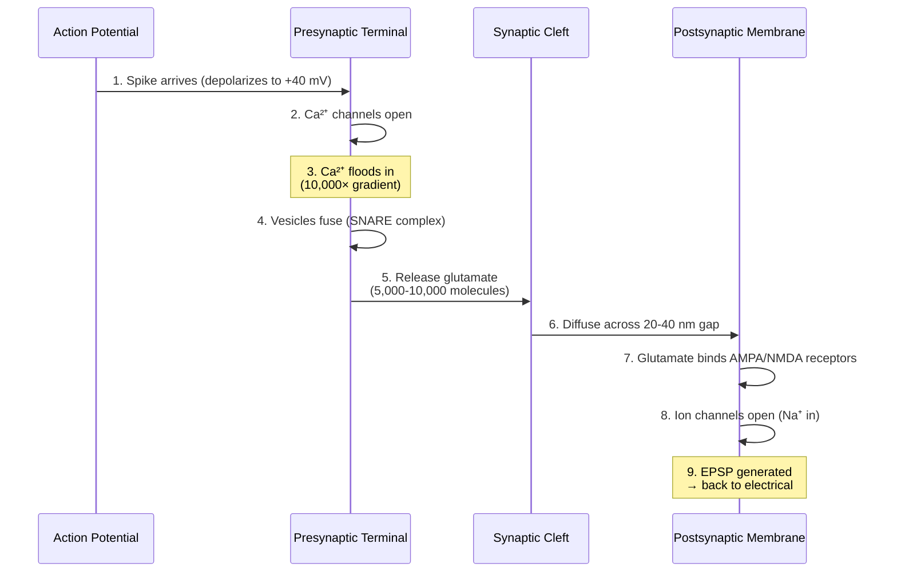

# Chapter 3: Synaptic Transmission

## The 9-step electrical → chemical → electrical process

When a signal passes from one neuron to the next, it switches from electrical (action potential) to chemical (neurotransmitter) and back to electrical (postsynaptic potential). This chapter traces that handoff in detail.

---

## Why chemical synapses?

Why not just connect neurons electrically? Here's the tradeoff:

| | Electrical synapses (gap junctions) | Chemical synapses |
|---|---|---|
| Speed | ~0.1 ms | 0.5–2 ms |
| Strength | **Fixed** | **Modifiable** |
| Learning | Impossible | Possible |
| Prevalence in adult brain | ~1% | ~99% |

**The brain chose plasticity over speed.** The chemical gap is what makes learning possible — synapses can grow stronger or weaker over time. Electrical synapses would be faster but fixed forever.

---

## The 9 steps at a glance



**Total time: 0.5–2 milliseconds** from spike arrival to postsynaptic response. Now let's walk through each step in detail.

---

## The 9 steps

### Step 1: Action potential arrives at terminal
The spike propagates down the axon (1–120 m/s) and reaches the bulbous terminal (0.5–2 µm diameter). The terminal contains 100–200 synaptic vesicles, each a 40–50 nm sphere filled with 5,000–10,000 neurotransmitter molecules. Terminal membrane depolarizes from –70 to +40 mV.

### Step 2: Ca²⁺ channels open
Voltage-gated Ca²⁺ channels clustered at "active zones" (50–200 per zone) open within 0.1 ms. They stay open 1–2 ms during the action potential peak.

### Step 3: Ca²⁺ floods in
The calcium gradient is enormous: 10,000:1 (outside:inside). Combined with the electrical gradient, the driving force is ~130 mV.
- Each channel passes 1–5 million ions per second.
- Local concentration near channels spikes from 0.0001 mM to **100 µM** — a 1000× increase — in 0.1 ms.
- This "nanodomain" signaling means vesicles must be within 10–50 nm of a Ca²⁺ channel to sense the spike. This gives precise control over which vesicles release.

### Step 4: Vesicles fuse with the membrane

**The molecular machinery:**
- **Synaptotagmin:** a Ca²⁺ sensor on the vesicle. Binds 3–5 Ca²⁺ ions to activate.
- **SNARE complex:** three proteins (synaptobrevin on vesicle, syntaxin + SNAP-25 on terminal). They wrap around each other, pulling vesicle and terminal membranes together.

**The fusion:**
1. Ca²⁺ binds synaptotagmin (0.05 ms)
2. Synaptotagmin triggers SNARE coiling (0.1 ms)
3. Membranes pulled within 2–3 nm
4. Lipid bilayers merge → fusion pore opens
5. Pore expands, vesicle empties

Total time from Ca²⁺ spike to release: **0.2–0.5 ms**.

### Step 5: Neurotransmitter released — NOW CHEMICAL
The fusion pore opens and 5,000–10,000 molecules spill into the synaptic cleft. Release time: 0.1–0.5 ms.

- **Weak synapse:** 0–1 vesicles per action potential (release probability 0.1–0.3).
- **Strong synapse:** 5–10 vesicles (probability 0.5–1.0).

**Vesicle pools:**
- Readily releasable pool: 5–20 vesicles docked at active zones (immediate use).
- Recycling pool: 50–100 (recruited in 0.5–5 seconds).
- Reserve pool: 50–100 (backup, slow).

Firing above 20 Hz depletes the readily releasable pool → synaptic fatigue.

### Step 6: Diffusion across the synaptic cleft
Distance: 20–40 nanometers. Molecules diffuse by random Brownian motion.
- Actual crossing time: 0.1–0.5 ms.
- Peak concentration in cleft: 1–3 mM (much higher than bulk brain fluid).
- Rapidly cleared by transporters and enzymes (glutamate: 1–2 ms; GABA: 3–5 ms) to prevent spillover to neighboring synapses.

### Step 7: Receptor binding
Lock-and-key specificity — each receptor type binds only its own neurotransmitter.
- Receptors clustered at the **postsynaptic density** — a 300–500 nm molecular machine with 1,000–2,000 proteins.
- **Weak synapse:** 50 AMPA receptors. **Strong synapse:** 500. This 10× difference is what learning has accomplished.

### Step 8: Ion channels open — BACK TO ELECTRICAL

**Glutamate (excitatory):**
- **AMPA receptors:** Open immediately. Pass mainly Na⁺ in, some K⁺ out. Current per channel: 0.5–2 pA.
- **NMDA receptors:** Pass Na⁺, K⁺, and Ca²⁺. **Blocked by Mg²⁺ at rest** — only open if BOTH glutamate is bound AND the membrane is already depolarized. This is **coincidence detection** — the molecular basis of Hebbian learning. See [Chapter 4](04-learning-mechanisms.md#why-nmda-is-special) for the full story of how this implements "neurons that fire together wire together."

**GABA (inhibitory):**
- **GABA-A receptors:** Open Cl⁻ channels → Cl⁻ flows in → membrane hyperpolarizes. Makes firing harder.

### Step 9: Postsynaptic potential generated

**EPSPs (excitatory):**
- Voltage change at the spine: +5 to +15 mV.
- At the soma (after attenuation): +0.1 to +2 mV per synapse.
- Duration: 5–20 ms. Multiple EPSPs sum if they arrive within 10–30 ms.

**IPSPs (inhibitory):**
- –5 to –10 mV at the synapse. Counteracts EPSPs.
- Duration: 10–50 ms (longer than EPSPs).

**Summation at the soma:**
```
V(soma) = −70 mV + Σ(EPSPs) − Σ(IPSPs)
```
If V ≥ −55 mV → action potential fires. Otherwise, no spike.

---

## Synaptic strength — what makes a synapse "strong"?

### Presynaptic factors (release)
- Vesicles released per AP: weak 0–1, strong 5–10
- Release probability: weak 0.1–0.3, strong 0.5–1.0
- Number of active zones: weak 1–2, strong 5–10

### Postsynaptic factors (response)
- AMPA receptors: weak 50, strong 500 (**10× difference**)
- NMDA receptors: weak 10, strong 100
- Spine volume: weak 0.1–0.3 µm³, strong 1–2 µm³

### How synapses change (learning preview)
- **Minutes:** Existing receptors modified (phosphorylated).
- **20–30 minutes:** New AMPA receptors inserted.
- **Hours:** Gene expression triggered, proteins synthesized.
- **Days–weeks:** Spine grows permanently, more receptors synthesized.

→ The full mechanism of how this strengthening happens is covered in [Chapter 4: Learning Mechanisms](04-learning-mechanisms.md).

---

## Key takeaway

> The 9-step conversion isn't just signal transmission — it's the mechanism that enables learning.
>
> The chemical gap allows synaptic strength to be modified. Every memory, every piece of knowledge you have, exists as patterns of strong and weak chemical synapses.
>
> Electrical synapses would be faster but fixed forever. The brain traded speed for plasticity. That's why you can learn.
