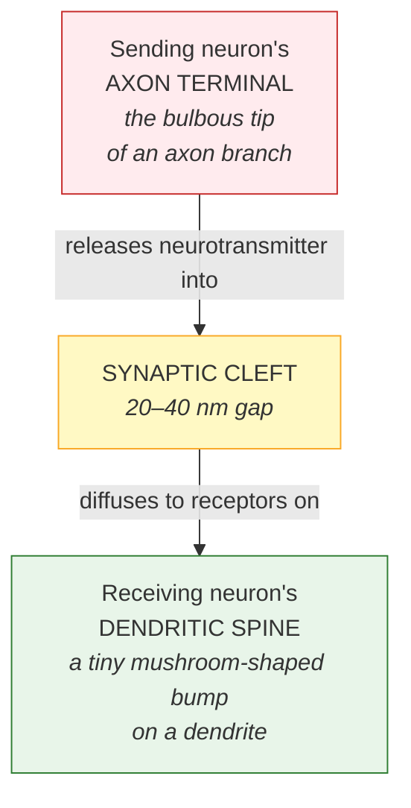
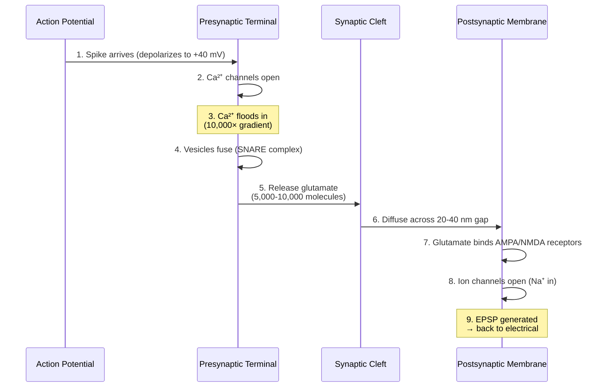

# Chapter 3: Synaptic Transmission

*The tiny chemical gap that lets you learn anything at all.*

> 📍 *In [Chapter 2](02-neural-communication.md), you watched a single spike travel down an axon at full strength. But here's the catch the spike runs into the moment it reaches the end of the wire: **the next neuron isn't connected to it**. There's a gap. This chapter is about how the spike crosses that gap — and why the brain made the gap on purpose.*

---

## The strangest design choice in your brain

A signal racing down an axon arrives at the terminal — and then has to cross a gap to reach the next neuron.

Not a small gap by atomic standards. **20 to 40 nanometers wide.** That's nothing in human terms — you could fit hundreds of these gaps across a single human hair. But for a signal that just traveled at 100 meters per second down a meter-long axon, this gap is a wall.

Why is it there at all?

Evolution could have wired neurons directly together. Some neurons in your body *are* connected that way — through electrical "gap junctions" — and signals jump across them in 0.1 milliseconds. Fast. Reliable. Boring.

Instead, almost every connection in your brain (~99% of them) uses a **chemical synapse**: the signal stops being electricity, becomes a chemical, drifts across the gap, and re-ignites electricity on the other side. The whole process takes 0.5 to 2 milliseconds — slower than a wire would have been.

The brain made this trade deliberately. It chose chemistry over speed. And in that one choice lies the entire reason you're capable of learning anything at all.

This chapter is about how that handoff works — and why every memory you have depends on it.

---

## Why chemistry beats wiring

Here's the trade-off in one table:

| | Electrical synapses (wires) | Chemical synapses (the brain's choice) |
|---|---|---|
| **Speed** | ~0.1 ms | 0.5–2 ms |
| **Strength** | **Fixed forever** | **Modifiable with experience** |
| **Learning** | Impossible | Possible |
| **Prevalence in adult brain** | ~1% | ~99% |

The chemical gap allows synapses to **strengthen, weaken, grow, or disappear** based on what you experience. A wired connection is set in metal — same strength forever. A chemical connection is *negotiable* — its strength can be tuned up by 10× over a few weeks of repeated use, or quietly fade if it's never visited.

**That tunability is learning.** Without it, you'd come out of the womb with a fixed brain and die with the same one. With it, you spend your entire life rewriting yourself.

---

## What a synapse looks like, structurally

Before the 9-step handoff, a quick anatomy refresher. A typical excitatory synapse has three parts:

Two crucial directional rules to keep straight (they're easy to fudge in casual descriptions):

1. **Synapses are directional.** Terminal sends. Spine receives. Signal flows one way: terminal → cleft → spine. Never the reverse.
2. **Dendritic spines exist only on the receiving side.** They never connect to other spines. They're the postsynaptic side of an excitatory synapse, full stop.

(Inhibitory GABA synapses can sit directly on the dendrite shaft or the soma rather than on a spine, but the directional rule still holds — terminal sends, postsynaptic side receives.)

With the geography clear, here's the handoff.

---

## The handoff, at a glance

Nine molecular events happen in sequence — start to finish in **under 2 milliseconds**:

Now let's slow each step down.

---

## The handoff, step by step

### Step 1 — The spike arrives
A 2-ms electrical wave, traveling at up to 120 m/s, reaches the bulbous axon terminal. The terminal's voltage shoots from −70 to +40 millivolts. Inside that terminal: 100–200 tiny membrane bubbles (vesicles), each pre-loaded with about 10,000 molecules of neurotransmitter. They've been waiting for this moment.

### Step 2 — Calcium gates open
The voltage change snaps open special **calcium channels** clustered at "active zones" (release sites) inside the terminal. They open in 0.1 milliseconds. Stay open for 1–2 milliseconds. Then close.

### Step 3 — Calcium floods in
Remember the calcium gradient from Chapter 2 — 10,000-to-1, much higher outside than inside. The moment the channels open, Ca²⁺ ions rush inward like water through a broken dam. Local concentration near the channels spikes 1000× in a tenth of a millisecond.

This calcium flood is the trigger. Everything that happens next is a response to it.

### Step 4 — Vesicles fuse with the membrane
Calcium binds to a sensor protein called **synaptotagmin** sitting on the vesicle surface. Synaptotagmin yanks on a molecular machine called the **SNARE complex** — three proteins that wrap around each other like a coiled rope, pulling the vesicle membrane and the terminal membrane together until they fuse.

The whole molecular ballet — calcium binding, SNARE coiling, fusion — completes in **0.2 to 0.5 milliseconds**.

### Step 5 — Neurotransmitter is released
The fused vesicle opens like a sac and dumps its 5,000–10,000 molecules of **glutamate** (the most common excitatory neurotransmitter) into the synaptic cleft.

This is the moment the signal stops being electricity and becomes chemistry.

How many vesicles release per spike depends on how strong the synapse is:
- A **weak synapse** might release 0–1 vesicles (release probability 0.1–0.3).
- A **strong, well-learned synapse** releases 5–10 vesicles (probability 0.5–1.0).

This is one of several places where learning is encoded.

### Step 6 — Glutamate diffuses across the gap
The molecules drift across the 20–40 nm gap by random motion. The distance is so small that diffusion takes only 0.1–0.5 milliseconds. Concentration in the cleft briefly spikes to 1–3 millimolar — a thousand times higher than the surrounding brain fluid.

The brain doesn't let this last. Within 1–2 milliseconds, transporters and enzymes clear the glutamate away — preventing the signal from leaking into neighboring synapses. **This is what keeps each synaptic connection precise instead of becoming a smeared wash.**

### Step 7 — Receptors catch the message
On the receiving side — the dendritic spine — receptors are waiting. They're protein complexes embedded in the membrane, tuned like locks to specific neurotransmitter keys. Glutamate fits two main receptor types:

- **AMPA receptors** — fast. Open immediately when glutamate binds.
- **NMDA receptors** — picky. Require glutamate AND already-depolarized membrane. They're coincidence detectors. Critical for learning. (Full story in [Chapter 4](04-learning-mechanisms.md).)

How many AMPA receptors are clustered at this synapse is one of the most important numbers in the whole brain. **A weak synapse: ~50. A strong synapse: ~500.** That 10× range is what learning has accomplished.

### Step 8 — Ion channels open, signal becomes electrical again
Each opened receptor is itself an ion channel. AMPA receptors let sodium ions flow into the spine. Sodium is the same ion that triggered the whole drama back at the sending neuron's axon — which means **the signal has now successfully translated back from chemistry to electricity** on the receiving side.

A small voltage bump — the **excitatory postsynaptic potential** (EPSP) — appears at the spine. Typically +5 to +15 mV at the spine itself.

### Step 9 — The bump travels toward the soma
The EPSP spreads from the spine, down the dendrite, toward the cell body. It weakens with distance. By the time it reaches the soma, it might be only +0.1 to +2 mV.

Trivial alone. But the soma is collecting hundreds of these bumps simultaneously, summing them up, and checking the threshold (Chapter 2). If enough EPSPs arrive close enough together, the soma fires its own action potential. The handoff repeats. The signal continues.

(Inhibitory GABA synapses produce **IPSPs** instead — small *negative* bumps that subtract from excitatory ones. The soma sums both excitatory and inhibitory inputs to make its decision.)

---

## Synaptic strength — what makes a synapse "strong"?

The technical term for how much voltage change a single synapse produces in the receiving neuron is **synaptic strength**. It's the canonical concept this whole chapter has been describing. (When you later read ML literature talking about "weights," that's the artificial-neural-network analog of biological synaptic strength. Same concept; biology calls it strength, ML calls it weight.)

Both sides of the synapse can be tuned:

**Presynaptic factors (release side):**
- Vesicles released per spike: weak 0–1, strong 5–10
- Release probability: weak 0.1–0.3, strong 0.5–1.0
- Number of active zones: weak 1–2, strong 5–10

**Postsynaptic factors (receiver side):**
- AMPA receptors: weak ~50, strong ~500 (**10× difference**)
- NMDA receptors: weak ~10, strong ~100
- Spine volume: weak 0.1–0.3 µm³, strong 1–2 µm³

### How synapses change over time
- **Minutes** — existing receptors modified (phosphorylated). Effect: temporary boost.
- **20–30 minutes** — new AMPA receptors trafficked into the membrane.
- **Hours** — gene expression triggers protein synthesis.
- **Days–weeks** — the spine itself physically grows. Permanent change.

→ The full mechanism is [Chapter 4: Learning Mechanisms](04-learning-mechanisms.md).

---

## Closing thought

> The 9-step conversion isn't just signal transmission. It's the mechanism that makes you capable of being a different person tomorrow than you are today.
>
> Every memory, every skill, every piece of knowledge you have, exists as patterns of strong and weak chemical synapses — patterns built one of these handoffs at a time, repeated billions of times, refined over years.
>
> An electrical synapse would be twice as fast. The brain didn't pick speed. It picked **plasticity** — and the gap is the price it pays. The ~1 millisecond delay each spike experiences crossing each synapse is the cost of being able to learn anything at all.
>
> That's a trade worth making. It's why you have a mind that grows.

---

> *We've established that synapses **can** strengthen and weaken — that's what the chemical gap enables. But the obvious next question is:* **how does the synapse decide when to strengthen?** *What's the actual molecular trigger that distinguishes an experience worth learning from one worth ignoring? That's [Chapter 4](04-learning-mechanisms.md).*
