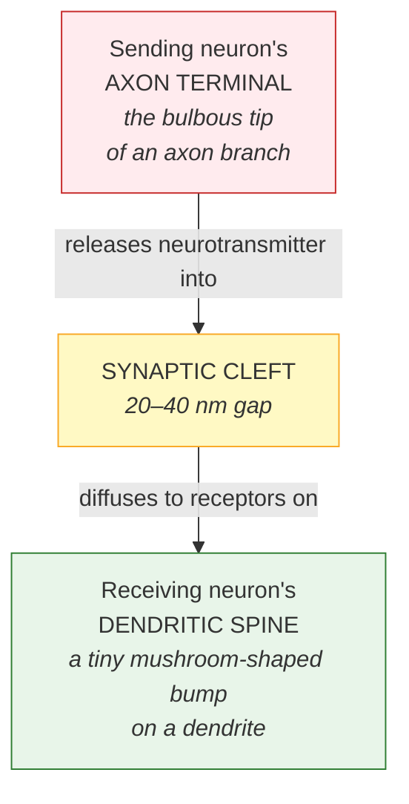
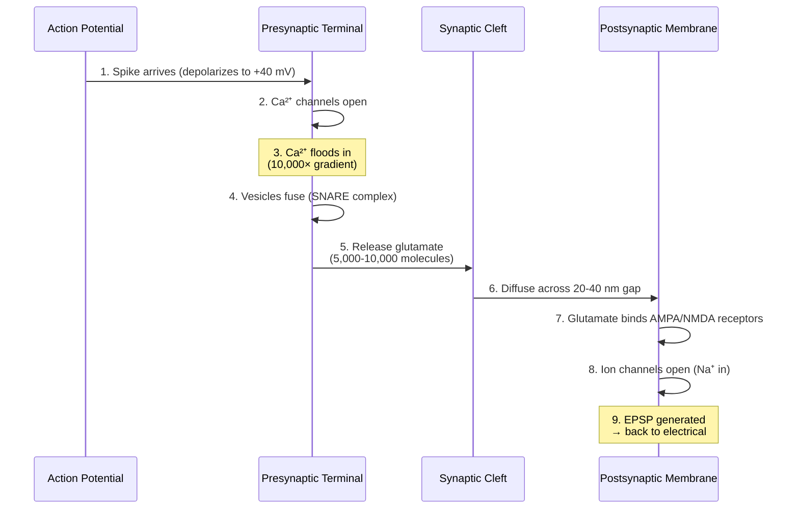

# Chapter 3: How a Signal Crosses Between Neurons

*The tiny chemical gap that lets you learn anything at all.*

> 📍 *In [Chapter 2](02-neural-communication.md), you watched a single spike travel down an axon at full strength. But here's the catch the spike runs into the moment it reaches the end of the wire: **the next neuron isn't connected to it**. There's a gap. This chapter is about how the spike crosses that gap — and why the brain made the gap on purpose.*

---

## The strangest design choice in your brain

A signal racing down an axon arrives at the terminal — and then has to cross a gap to reach the next neuron.

Not a small gap by atomic standards. **20 to 40 nanometers wide.** That's nothing in human terms — you could fit hundreds of these gaps across a single human hair. But for a signal that just traveled at 100 meters per second down a meter-long axon, this gap is a wall.

Why is it there at all?

Evolution could have wired neurons directly together. Some neurons in your body *are* connected that way — through electrical "gap junctions" — and signals jump across them in 0.1 milliseconds. Fast. Reliable. Boring.

Instead, almost every connection in your brain (~99% of them) uses a **chemical synapse**: the signal stops being electricity, becomes a chemical, drifts across the gap, and re-ignites electricity on the other side. The whole process takes 0.5 to 2 milliseconds — slower than a wire would have been.

The brain made this trade deliberately. It chose chemistry over speed. And in that one choice lies the entire reason you're capable of learning anything at all.

This chapter is about how that handoff works — and why every memory you have depends on it.

---

## Why chemistry beats wiring

Here's the trade-off in one table:

| | Electrical synapses (wires) | Chemical synapses (the brain's choice) |
|---|---|---|
| **Speed** | ~0.1 ms | 0.5–2 ms |
| **Strength** | **Fixed forever** | **Modifiable with experience** |
| **Learning** | Impossible | Possible |
| **Prevalence in adult brain** | ~1% | ~99% |

The chemical gap allows synapses to **strengthen, weaken, grow, or disappear** based on what you experience. A wired connection is set in metal — same strength forever. A chemical connection is *negotiable* — its strength can be tuned up by 10× over a few weeks of repeated use, or quietly fade if it's never visited.

**That tunability is learning.** Without it, you'd come out of the womb with a fixed brain and die with the same one. With it, you spend your entire life rewriting yourself.

---

## What a synapse looks like, structurally

Before the 9-step handoff, a quick anatomy refresher. A typical excitatory synapse has three parts:

Two crucial directional rules to keep straight (they're easy to fudge in casual descriptions):

1. **Synapses are directional.** Terminal sends. Spine receives. Signal flows one way: terminal → cleft → spine. Never the reverse.
2. **Dendritic spines exist only on the receiving side.** They never connect to other spines. They're the postsynaptic side of an excitatory synapse, full stop.

(Inhibitory GABA synapses can sit directly on the dendrite shaft or the soma rather than on a spine, but the directional rule still holds — terminal sends, postsynaptic side receives.)

With the geography clear, here's the handoff.

---

## The handoff, at a glance

Nine molecular events happen in sequence — start to finish in **under 2 milliseconds**:

To make this concrete, let's stop describing it abstractly and watch it happen.

---

## Watch one synapse, end to end

Imagine zooming in on a single specific synapse — buried somewhere in your visual cortex, between one neuron processing the letter "A" you're reading right now and the next neuron in line. Two neurons. One gap. The whole drama plays out over about two milliseconds.

Slow time down. Watch.

### The spike arrives

A 2-millisecond electrical wave, traveling at over 100 meters per second, has just reached the sending neuron's axon terminal — a bulbous tip about a thousandth of a millimeter wide. The terminal's voltage shoots from −70 millivolts to +40 millivolts in a heartbeat.

Inside the terminal sit dozens of tiny membrane bubbles called **vesicles** — each pre-loaded with about 10,000 molecules of a neurotransmitter called **glutamate**, ready to be dumped into the gap. They've been waiting for exactly this moment.

### Calcium floods in

The voltage change snaps open special **calcium channels** clustered near the terminal's release sites. Outside the terminal, calcium is roughly 10,000 times more concentrated than inside (recall the gradient from [Chapter 2](02-neural-communication.md)). The moment those gates open, calcium rushes inward like water through a broken dam. Local concentration spikes a thousandfold in a tenth of a millisecond.

That calcium flood is the trigger for everything that follows.

### The vesicles fuse with the membrane

Calcium grabs onto a sensor protein on the vesicles' surface, called **synaptotagmin**. Synaptotagmin yanks on a molecular machine called the **SNARE complex** — three proteins that wrap around each other like a coiled rope, pulling the vesicle membrane and the terminal membrane together until they fuse into one continuous wall.

The whole molecular ballet — calcium binding, SNARE coiling, membrane fusion — completes in about half a millisecond.

### The glutamate spills across the gap

The fused vesicles open like sacs and dump their contents into the **synaptic cleft** — the 20-to-40-nanometer gap between this synapse's two sides. **This is the moment the signal stops being electricity and becomes chemistry.**

How many vesicles release depends on this specific synapse's strength. A weak, rarely-used synapse might release zero or one. A strong, well-learned synapse releases five to ten. (This is the first of several places where learning leaves its mark.)

The molecules drift across the gap by random motion. The distance is so small that diffusion takes only a tenth to half a millisecond. Concentration in the cleft briefly hits a thousand times higher than the surrounding brain fluid — then transporters and enzymes start cleaning up, preventing the signal from leaking into neighboring synapses. **That cleanup is what keeps each synaptic connection precise rather than smearing into a wash.**

### Receptors catch the message

On the receiving side — the dendritic spine of the next neuron — receptors are waiting. They're protein complexes embedded in the membrane, tuned like locks that only specific neurotransmitter keys can open. Two main types catch glutamate:

- **AMPA receptors** — fast. Open immediately when glutamate binds.
- **NMDA receptors** — picky. Open only when glutamate AND already-active conditions are both met at the same instant. They're coincidence detectors. Critical for learning. (Full story in [Chapter 4](04-learning-mechanisms.md).)

How many AMPA receptors live at this specific spine is one of the most important numbers in the whole brain. A weak synapse: about 50. A strong synapse: about 500. **That 10× range is the physical record of what learning has already done at this exact location.**

### The signal becomes electrical again

Each opened AMPA receptor is itself an ion channel. As glutamate binds, the channels let sodium flow into the spine — the same ion that started the whole drama back at the sending neuron's axon. The signal has now successfully translated chemistry → electricity on the receiving side.

A small voltage bump appears at the spine. About +5 to +15 millivolts. Tiny.

### The bump travels

The bump spreads from the spine, down the dendrite, toward the receiving neuron's cell body. It weakens with distance. By the time it reaches the soma, it might be only a fraction of a millivolt.

Trivial alone. But this isn't the only synapse firing right now. The receiving neuron is collecting hundreds of these bumps from hundreds of other synapses simultaneously, summing them all together, and checking the firing threshold (the same one from [Chapter 2](02-neural-communication.md)). If enough bumps arrive close enough together, *that* neuron fires its own spike — and the handoff repeats one synapse downstream. The signal continues across the brain.

End of drama. Total elapsed time: about 1.5 milliseconds.

---

> *(Footnote: inhibitory GABA synapses do the same dance, but in reverse — they produce small **negative** bumps that subtract from the excitatory ones. The receiving soma weighs both kinds together when deciding whether to fire.)*

---

## Synaptic strength — what makes a synapse "strong"?

The technical term for how much voltage change a single synapse produces in the receiving neuron is **synaptic strength**. It's the canonical concept this whole chapter has been describing. (When you later read ML literature talking about "weights," that's the artificial-neural-network analog of biological synaptic strength. Same concept; biology calls it strength, ML calls it weight.)

Both sides of the synapse can be tuned:

**Presynaptic factors (release side):**
- Vesicles released per spike: weak 0–1, strong 5–10
- Release probability: weak 0.1–0.3, strong 0.5–1.0
- Number of active zones: weak 1–2, strong 5–10

**Postsynaptic factors (receiver side):**
- AMPA receptors: weak ~50, strong ~500 (**10× difference**)
- NMDA receptors: weak ~10, strong ~100
- Spine volume: weak 0.1–0.3 µm³, strong 1–2 µm³

### How synapses change over time
- **Minutes** — existing receptors modified (phosphorylated). Effect: temporary boost.
- **20–30 minutes** — new AMPA receptors trafficked into the membrane.
- **Hours** — gene expression triggers protein synthesis.
- **Days–weeks** — the spine itself physically grows. Permanent change.

→ The full mechanism is [Chapter 4: Learning Mechanisms](04-learning-mechanisms.md).

---

## Closing thought

> The 9-step conversion isn't just signal transmission. It's the mechanism that makes you capable of being a different person tomorrow than you are today.
>
> Every memory, every skill, every piece of knowledge you have, exists as patterns of strong and weak chemical synapses — patterns built one of these handoffs at a time, repeated billions of times, refined over years.
>
> An electrical synapse would be twice as fast. The brain didn't pick speed. It picked **plasticity** — and the gap is the price it pays. The ~1 millisecond delay each spike experiences crossing each synapse is the cost of being able to learn anything at all.
>
> That's a trade worth making. It's why you have a mind that grows.

---

> *We've established that synapses **can** strengthen and weaken — that's what the chemical gap enables. But the obvious next question is:* **how does the synapse decide when to strengthen?** *What's the actual molecular trigger that distinguishes an experience worth learning from one worth ignoring? That's [Chapter 4](04-learning-mechanisms.md).*
