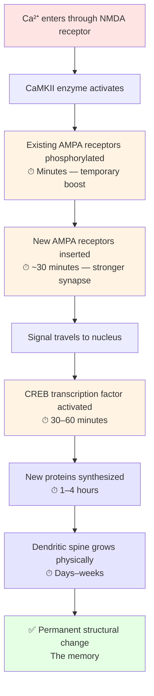

# Chapter 4: Learning Mechanisms

*The molecular construction project that turns experience into permanent change.*

> 📍 *[Chapter 3](03-synaptic-transmission.md) showed you that synapses can be tuned — that's the whole reason for the chemical gap. This chapter answers the natural follow-up: **what actually triggers a synapse to strengthen?** When does the brain decide "this connection matters, build it up"? The answer turns out to be a single molecular detector that elegantly implements one of the most famous rules in neuroscience.*

---

## What learning actually is

Strip away the metaphors and learning has a single physical definition:

> **Learning is the modification of synaptic strength.**

That's it. When you learn something, certain specific synapses become stronger. When you forget, they weaken. The pattern of which synapses are strong and which are weak — across thousands of connections — is the memory itself.

Everything else in this chapter is about *how* that strength change happens at the molecular level: what triggers it, what enzymes carry it out, what makes it permanent, and what derails it.

## The moment a memory begins

Imagine you're sitting in a class. The teacher writes an equation on the board: F = m × a. You see it. You read it. You think you understand it.

In that instant, somewhere deep in your brain — at one specific synapse, between two specific neurons you'll never know the names of — a tiny molecular drama begins. **The synaptic strength of that connection is about to change.**

A protein opens. A handful of calcium ions rush in. An enzyme activates. Nearby receptors get tagged. A signal travels toward the cell's nucleus. Hours later, while you sleep, new proteins are manufactured and shipped to that synapse. Days later, the synapse is physically larger than it was. Weeks later, the connection is permanently stronger than it was an hour before class.

That entire molecular project — repeated across thousands of synapses, each one having its strength adjusted — *is* you learning F = ma.

This chapter is about what that project actually looks like, step by step.

---

## The detector that started it all

In 1949, the Canadian psychologist Donald Hebb proposed a deceptively simple rule:

> **Neurons that fire together, wire together.**

Meaning: if neuron A is active and neuron B is active *at the same moment*, the connection between them should strengthen. Repeated coincidence builds the connection. That's how the brain decides which connections matter.

Hebb's rule was philosophical when he wrote it. It needed a molecular implementation — a physical detector that could notice when two neurons fired together and selectively strengthen *those specific* synapses.

We now know the detector. It's a receptor protein called **NMDA**.

### Why NMDA is special

Most receptors are simple: neurotransmitter binds → channel opens → ions flow. NMDA is fussier. It demands **two conditions at the same time**:

1. **Glutamate must be bound** — meaning the *sending* neuron just fired.
2. **The membrane must already be depolarized** — meaning the *receiving* neuron is also firing right now.

At rest, the NMDA channel is physically blocked by a magnesium ion (Mg²⁺) sitting in the pore. Glutamate alone can't dislodge it. Only when the postsynaptic neuron is itself active does the depolarization eject the magnesium.

When *both* conditions are met, the channel finally opens — and calcium floods in.

That calcium is the **learning signal**. The synapse has just been told: *this connection just experienced a coincidence. Strengthen it.*

Here's how the NMDA gate behaves in three different scenarios:

```
   SCENARIO 1: At rest          SCENARIO 2: Sender fires      SCENARIO 3: BOTH neurons
   (neither neuron firing)      but receiver still quiet       firing at the same moment

      sender (quiet)                sender (FIRES!)              sender (FIRES!)
          │                              │                            │
          │ ← no glutamate               ▼ glutamate ●●●              ▼ glutamate ●●●
          │
                                   ┌────────────┐               ┌────────────┐
      ┌──────────┐                 │   NMDA     │               │   NMDA     │
      │  NMDA    │                 │            │               │            │
      │ ╭───╮    │                 │ ╭───╮      │               │ ╭ open ╮   │
      │ │Mg²⁺│ ← │                 │ │Mg²⁺│ ←   │               │ │      │   │
      │ ╰───╯ blocks│                │ ╰───╯ STILL │               │ ╰──────╯ ← Mg²⁺
      │  the gate │                 │  blocks the │               │  EJECTED!
      │           │                 │  gate       │               │  ●●●●●● Ca²⁺
      │ no Ca²⁺   │                 │ (glutamate  │               │  flooding in
      │ flow      │                 │  alone     │                │
      └───────────┘                 │  isn't     │                │ receiver:
                                    │  enough)   │                │ ALSO firing
      receiver: resting             │            │                │ (depolarized)
                                    │ no Ca²⁺    │                └────────────┘
                                    │ flow       │                       │
                                    └────────────┘                       ▼
                                                                  LEARNING SIGNAL
                                    receiver: resting             (synapse strengthens)
   ────────────────────────────────────────────────────────────────────────
   Why NMDA is the molecular implementation of Hebb's rule:
   BOTH neurons must be active simultaneously for the gate to open.
   Calcium only flows when "fire together" actually happens.
```

This is exactly Hebb's rule, implemented in protein. The brain doesn't strengthen all active synapses — it strengthens only those where the sender and the receiver were both firing in the same moment. That selectivity is what allows learning to be specific instead of indiscriminate.

---

## The calcium cascade — turning a moment into permanence

Calcium entering through NMDA isn't itself the memory. It's the *trigger* for a multi-stage construction project that unfolds across timescales — from milliseconds to weeks. Each stage builds on the previous.



Read top to bottom — that's the timeline. **Each stage depends on the one before it.** Skip the early stages and the cascade stalls. Skip the later stages (mostly because you didn't sleep) and the early changes decay.

What's actually happening at each stage — and what each stage does to **synaptic strength**:

1. **Calcium activates enzymes** — most importantly CaMKII (calcium/calmodulin-dependent kinase II). This is the master switch. *(Synaptic strength: still unchanged. The signal has just arrived.)*
2. **Existing AMPA receptors get phosphorylated** (within minutes). A chemical tag makes them more conductive and more stable. *(Synaptic strength: rises, but only temporarily — fragile.)*
3. **New AMPA receptors get inserted** into the membrane (~30 minutes). *(Synaptic strength: now physically higher — more receptors mean a bigger response to the next signal. Still reversible.)*
4. **A signal travels to the nucleus** via second-messenger molecules. *(Strength unchanged here — but the cell is being told to start building.)*
5. **The CREB transcription factor activates** (30–60 minutes), turning on a specific set of "learning genes."
6. **New proteins are synthesized** (1–4 hours) — receptors, scaffolding molecules, structural proteins. *(Synaptic strength: stabilizing. The temporary boost is becoming permanent.)*
7. **The dendritic spine itself grows physically** (days–weeks). Volume can triple. *(Synaptic strength: locked in at the new higher level. Permanent unless unused for months.)*

The whole cascade has done one thing: **moved the synapse from weak (~50 AMPA receptors, 0.3 µm³ spine volume) to strong (~500 receptors, 1.5 µm³).** A 10× increase in synaptic strength.

That 10× change *is* the memory. It's not stored anywhere. It IS the synapse, in its new strengthened form.

---

## Why two students learn the same lesson differently

Two students sit in the same class. Same teacher writes F = m × a on the same board.

Student A walks out understanding it. A week later, she can use it, explain it, apply it to a problem she's never seen.

Student B walks out having read the words. A week later, he's forgotten almost everything.

Same input. Vastly different outcomes. What was different?

Student A engaged the material from many angles simultaneously. Student B engaged from very few.

### Student A's brain — many angles, deep encoding

While reading the equation, she:

1. **Verbally** rehearsed it: *"force equals mass times acceleration"*
2. **Visually** absorbed the symbols
3. **Concretely** imagined the teacher pushing a desk
4. **Memory-wise** recalled pushing a shopping cart, full vs empty
5. **Mathematically** noticed: if mass goes up, acceleration goes down
6. **Kinesthetically** felt the effort of pushing a heavy thing
7. **Causally** asked: *why* does more mass need more force?
8. **Predictively** imagined: *what if I doubled the mass?*
9. **Cross-domain** noticed it's like economics (more inertia = harder to change)
10. **Emotionally** connected it to her own car feeling sluggish when loaded
11–15. **Integrated** all of the above with what she already knew

Each angle activated a different brain region. Each region had its own NMDA receptors firing. Each one triggered its own calcium cascade. By the end of the class, **thousands of synapses across many networks had begun strengthening simultaneously**.

The memory wasn't stored in one place. It was distributed across a rich, interconnected web — which means many different cues can later retrieve it. Hard to forget.

### Student B's brain — few angles, shallow encoding

He read the equation and looked at a diagram. That's it. Two angles.

A handful of synapses in a couple of regions began strengthening — but isolated, with few cross-links. By morning, most of the temporary changes had decayed without anything permanent forming.

Visualized as which brain regions activate in each student:

```
   STUDENT A (deep learner)              STUDENT B (shallow learner)
   reads "F = m × a"                     reads "F = m × a"

   Vision           ●●●●●                Vision           ●●
   Language         ●●●●●                Language         ●●
   Math             ●●●●●                Math             ○
   Memory           ●●●●●                Memory           ○
   Motor cortex     ●●●●●                Motor cortex     ○
   Causal reasoning ●●●●●                Causal reasoning ○
   Predictive       ●●●●●                Predictive       ○
   Cross-domain     ●●●●●                Cross-domain     ○
   Emotional        ●●●●●                Emotional        ○
   Integration      ●●●●●                Integration      ○

   ~15 regions firing in                  ~2 regions firing
   coordinated patterns                   in isolation

   ↓                                       ↓

   THOUSANDS of synapses begin             A HANDFUL of synapses
   strengthening across many               briefly strengthen, then
   networks. Cross-links form              decay overnight without
   between regions during sleep.           cross-linking.

   Result one week later:                  Result one week later:
   Solid, retrievable understanding.       Forgotten almost everything.
```

This isn't because Student A is smarter. It's because she **engaged the material from many angles simultaneously** — and each angle activated NMDA receptors in a different region, triggering parallel calcium cascades.

### The takeaway

This isn't a difference in **intelligence**. It's a difference in **how you process**. Engaging multiple angles isn't a personality trait — it's a deliberate practice you can choose, every time you sit down to learn something.

This is one of the few things about your own learning that you can directly control. And it has the highest leverage of anything in the chapter.

---

## What blocks learning

The calcium cascade is fragile. Several common conditions can prevent it from finishing — meaning the synaptic changes never become permanent.

### 1. Lack of sleep
Steps 5–7 of the cascade — the protein synthesis and structural changes — depend heavily on sleep. A student who studies hard and then stays up all night has built scaffolding without ever pouring the foundation. By morning, the temporary changes have decayed and the permanent ones never formed. (Full story in [Chapter 10](10-sleep-memory-forgetting.md).)

### 2. Chronic stress
Brief stress actually *helps* encoding — cortisol flags the moment as important. But sustained high cortisol does the opposite:
- Shrinks dendritic spines in the hippocampus (the brain's memory encoder).
- Impairs LTP (the long-term strengthening that makes memories stick).
- Reduces BDNF, a protein essential for growing new synapses.

This is why people under chronic stress feel foggy and can't retain new information. The machinery is being actively dismantled.

### 3. Fragmented attention
If acetylcholine is low — because you're distracted, multitasking, or tired — neurons don't respond strongly enough to inputs for NMDA receptors to open reliably. The glutamate arrives. The postsynaptic neuron barely depolarizes. The Mg²⁺ block never comes off. **No calcium. No learning signal. No memory.**

This is the molecular reason multitasking destroys learning.

### 4. Missing prior knowledge
If the new material has nothing to anchor to — no existing network of related concepts — there's nothing for new synapses to cross-link with. The knowledge forms an isolated island, easy to forget. This is why a beginner can read an expert's paragraph five times without it sticking. There are no hooks yet.

The opposite is also true: the more you know in a domain, the easier new information in that domain is to retain. This is one reason expertise compounds.

### 5. Protein-synthesis disruption
In lab experiments, drugs that block protein synthesis (like anisomycin) completely prevent long-term memory formation, even when short-term memory works fine. Heavy alcohol use, some medications, and severe illness can have similar effects — they specifically disrupt the consolidation window without blocking the initial experience.

You can experience something fully and still fail to remember it, if the protein-synthesis stage gets blocked.

---

## Sleep finishes what waking starts

The calcium cascade *starts* during waking experience but a large part of its *completion* happens during sleep. This is well-established now:

- **Slow-wave sleep** (deep, early-night sleep) is critical for **declarative memory** — facts, concepts, anything you can put into words. During slow-wave sleep, the hippocampus replays recent experiences to the cortex, gradually moving them from short-term to long-term storage.
- **REM sleep** (later in the night) is critical for **procedural memory and emotional processing** — motor skills, pattern learning, integrating new material with existing knowledge.
- **Sleep spindles** (short bursts of brain activity during light sleep) correlate strongly with how much material is retained from the previous day's study.

**Practical implication:** studying right before sleep beats studying in the morning for retention (controlling for everything else). And pulling all-nighters before exams is counterproductive even from a pure-score perspective. You'd score better by studying less and sleeping normally.

---

## The spacing effect

One of the most robust findings in learning science: **spaced repetition dramatically outperforms cramming.** Always.

### Why it works at the cellular level

When you study something, synapses strengthen briefly. If you immediately restudy, you're reinforcing already-active synapses — and you get diminishing returns. But if you wait until those synapses have *partially decayed*, then restudy, you're rebuilding them — and the rebuild is stronger than the original.

Think of it like exercise. Doing 100 push-ups in a single set builds less muscle than doing 20 push-ups a day for five days. The recovery between sessions is where the growth happens. Synapses follow the same principle. **Recovery time is part of learning, not a break from it.**

### A practical schedule

The intervals roughly double each time:

- Review 1: 1 day after first exposure
- Review 2: 3 days later
- Review 3: 1 week later
- Review 4: 2 weeks later
- Review 5: 1 month later

After five well-spaced reviews, most material is effectively permanent. Tools like Anki automate this schedule. They're not magic — they're just applied neuroscience. (Detailed strategies in [Chapter 11](11-applying-the-science.md).)

---

## Closing thought

> Learning isn't something you do *to* your brain. It's something your brain does in response to your activities — and it has specific molecular requirements.
>
> Repetition alone isn't enough. Attention alone isn't enough. Even motivation alone isn't enough. To learn something deeply and permanently, you need:
>
> - **Multiple processing angles** — to activate many synapses across many regions
> - **Spaced repetition** — to rebuild rather than reinforce
> - **Sleep** — to consolidate through protein synthesis
> - **Low chronic stress** — to allow protein synthesis to happen at all
> - **Connection to prior knowledge** — to anchor the new in the old
>
> Each of these corresponds to a specific stage in the calcium cascade. The advice isn't folk wisdom. It's molecular biology.
>
> The next time you "can't seem to remember" something you studied yesterday — it's almost never that you didn't try hard enough. It's that one or more of those five conditions wasn't met, and the cascade stalled before it could finish.

---

> *We've now traced learning all the way down — from the experience that triggers it to the molecular cascade that builds it. But there's something we've been quietly oversimplifying. We've been treating each neuron as a single decision-making unit. The truth is more interesting: a single neuron is doing far more computation than that, in ways most explanations (and most AI) completely miss. That's [Chapter 5](05-computational-hierarchy.md).*
