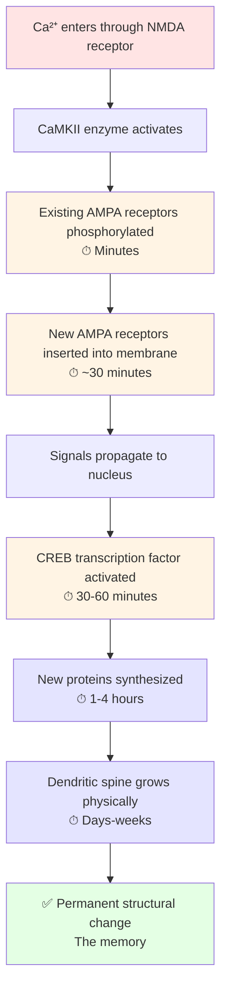

# Chapter 4: Learning Mechanisms

## Hebb's Law and NMDA receptors

"Neurons that fire together wire together" — Hebb's famous principle — isn't just an abstract rule. It has a specific molecular implementation: the **NMDA receptor**, which is a biochemical coincidence detector. (If you haven't read about NMDA receptors yet, see [Chapter 3](03-synaptic-transmission.md#step-8-ion-channels-open--back-to-electrical) for the basics.)

### Why NMDA is special

An NMDA receptor only opens when **both** conditions are met simultaneously:

1. **Glutamate is bound** (presynaptic neuron fired)
2. **The postsynaptic membrane is depolarized** (postsynaptic neuron is already active)

At rest, NMDA channels are physically blocked by a Mg²⁺ ion sitting in the pore. Depolarization pops that Mg²⁺ out. Without depolarization, even with glutamate bound, the channel stays blocked.

When both conditions are met → Mg²⁺ pops out → Ca²⁺ floods in → **learning signal**.

This is how the synapse "knows" that pre- and postsynaptic neurons fired together. Only those synapses get to strengthen.

---

## The calcium cascade — 7 steps from activation to permanence

Once Ca²⁺ enters through an NMDA receptor, a cascade of molecular events unfolds across multiple timescales. Here's the whole cascade in one picture:

**The crucial point:** each step depends on the one before it. If you sleep before the protein synthesis step, it happens. If you skip sleep, the cascade stalls and you're left with only the temporary early changes — which decay within hours.

Now the step-by-step details:

1. **Ca²⁺ activates enzymes** — most importantly CaMKII (calcium/calmodulin-dependent kinase II).
2. **Existing AMPA receptors phosphorylated** (minutes) — they become more conductive and more stable.
3. **New AMPA receptors inserted into the membrane** (~30 minutes) — synapse becomes stronger.
4. **Signals propagate to the nucleus** via second messengers.
5. **Gene expression activated** (CREB transcription factor turns on learning genes).
6. **New proteins synthesized** (hours) — receptors, scaffolding, adhesion molecules.
7. **Spine grows permanently** (days-weeks) — actin polymerizes, spine volume increases 3–5×.

The result: a synapse that was weak (50 AMPA receptors, 0.3 µm³) becomes strong (500 receptors, 1.5 µm³). That change *is* the memory.

---

## Deep vs shallow learning

Two students learn the same concept — F = ma. Same information, same teacher. Yet one develops a fluent understanding and one barely remembers it a week later. Why?

The answer isn't intelligence — it's **how many processing angles each engages**.

### Student A (deep learner) — ~15 processing angles

1. **Verbal:** "Force equals mass times acceleration"
2. **Visual:** Sees the written equation
3. **Concrete:** Watches a teacher push a desk
4. **Memory:** Recalls pushing a shopping cart (empty vs full)
5. **Mathematical:** Notices that if m↑, a↓ for fixed F
6. **Kinesthetic:** Feels the physical effort of pushing
7. **Causal:** Asks *why* more mass needs more force
8. **Predictive:** Imagines "If I double the mass..."
9. **Cross-domain:** Sees analogies in economics, biology
10. **Emotional:** "This explains why my car feels sluggish fully loaded!"
11–15. **Integration:** Weaves all of the above into existing knowledge

Each angle activates different brain regions → massive NMDA activation across distributed networks → calcium cascades fire at thousands of synapses → permanent structural changes across many interconnected pathways.

### Student B (shallow learner) — 2–3 angles

Verbal + visual only. Reads the equation, maybe looks at a diagram. That's it.

Result: weak, localized, temporary changes. Forgotten within days.

### The takeaway

**Same information, vastly different neural architectures.** The deep learner engaged 14–15 brain systems; the shallow learner engaged 2–3. This isn't a matter of being "smarter" — it's about *how* you process.

Deliberately engaging multiple processing angles (explanation, example, analogy, prediction, connection to prior knowledge) is one of the few things you can directly control to make learning stick.

---

## What blocks learning

The calcium cascade is fragile. Several common conditions can prevent it from finishing — meaning the synaptic changes never become permanent.

### 1. Lack of sleep
Protein synthesis (steps 5–6 of the cascade) depends heavily on sleep, especially **slow-wave sleep** (deep, early-night sleep) and **REM sleep** (dream-heavy, later-night sleep). A student who studies hard and then stays up all night has essentially built scaffolding without ever pouring the foundation. By morning, the temporary changes have decayed and the permanent ones never formed. (See [Chapter 11](11-sleep-memory-forgetting.md) for the full role of sleep in consolidation.)

### 2. Chronic stress
Stress floods the brain with **cortisol**. In small doses, cortisol actually helps encoding — it flags events as important. But sustained high cortisol:
- **Shrinks dendritic spines** in the hippocampus (the brain's memory encoder).
- **Impairs LTP** — the long-term strengthening that makes memories stick.
- **Reduces BDNF**, a protein essential for growing new synapses.

This is why people under chronic stress feel foggy and struggle to retain new information.

### 3. Fragmented attention
If acetylcholine levels are low — because you're distracted, multitasking, or tired — your neurons simply don't respond strongly enough to inputs for NMDA receptors to open reliably. The glutamate arrives. The postsynaptic neuron barely depolarizes. The Mg²⁺ block never comes off. No calcium. No learning signal. No memory.

### 4. Missing prior knowledge
If the material has nothing to anchor to — no existing network of related concepts — there's nothing for the new synapses to cross-link with. The knowledge forms an isolated island that's easy to forget. This is why a beginner can read an expert's paragraph five times without retaining it; there are no hooks.

### 5. Protein-synthesis disruption
In lab experiments, blocking protein synthesis (with drugs like anisomycin) completely prevents long-term memory formation, even when short-term memory works fine. Alcohol, some drugs, and severe illness can have similar effects — they specifically disrupt the consolidation window without blocking the initial experience.

---

## Sleep-dependent consolidation

The calcium cascade starts during waking experience, but a large part of its *completion* happens during sleep.

Here's what's now well-established:

- **Slow-wave sleep (deep sleep)** appears critical for **declarative memory** — facts, concepts, things you can put into words. During slow-wave sleep, the hippocampus replays recent experiences to the cortex, gradually transferring memories into long-term storage.
- **REM sleep** appears critical for **procedural memory and emotional processing** — motor skills, pattern learning, integration with existing knowledge.
- **Spindles** — short bursts of brain activity during light sleep — correlate strongly with how much material a student retains from the previous day's study.

Practical implication: studying right before sleep (rather than right before bed-time scrolling) measurably improves retention. And pulling all-nighters before exams is counterproductive even from a pure-performance standpoint — you'd score better by studying less and sleeping more.

---

## The spacing effect

One of the most robust findings in learning science is that **spaced repetition dramatically outperforms massed practice** (cramming).

### Why it works at the cellular level

When you study something once, synapses strengthen briefly. If you restudy immediately, you're reinforcing synapses that are already active — you get diminishing returns. But if you wait until those synapses have partially decayed, then restudy, you're essentially rebuilding them — and the rebuild is stronger than the original.

Think of it like exercise. Doing 100 push-ups in a row builds less muscle than doing 20 push-ups a day for five days. Synaptic strength follows the same principle: **the recovery period between sessions is where the growth happens.**

### A practical schedule

Roughly:
- Review 1: 1 day after first exposure
- Review 2: 3 days after that
- Review 3: 1 week later
- Review 4: 2 weeks later
- Review 5: 1 month later

Each spaced review strengthens the synapses more than the previous one, with diminishing time investment. After five well-spaced reviews, most material is effectively permanent.

Tools like Anki and similar spaced-repetition software automate this schedule. They aren't magic — they're just applied neuroscience. (See [Chapter 12](12-applying-the-science.md) for practical study strategies.)

---

## Closing thought

> Learning isn't something you do *to* your brain. It's something your brain does in response to your activities — and it has specific requirements. Repetition alone isn't enough. Attention alone isn't enough. Even motivation alone isn't enough.
>
> To learn something deeply and permanently, you need: multiple processing angles (to activate many synapses), spaced repetition (to rebuild rather than reinforce), sleep (to consolidate through protein synthesis), low chronic stress (to allow protein synthesis at all), and connection to prior knowledge (to anchor the new in the old).
>
> Each of these corresponds to a specific mechanism in the calcium cascade. The advice isn't folk wisdom. It's molecular biology.
