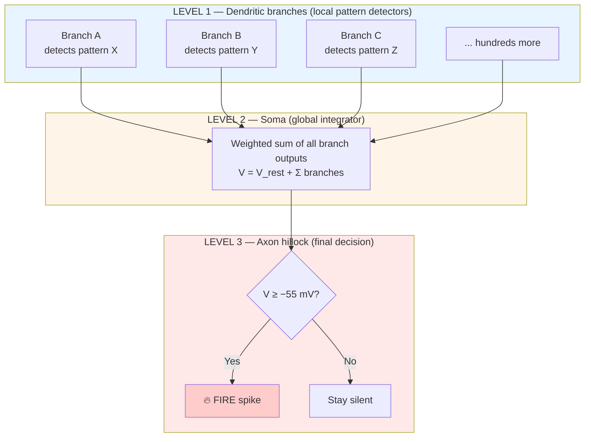

# Chapter 5: The Hidden Depth of a Single Neuron

*Why one biological neuron is more powerful than an entire artificial one — and what that means for AI.*

> 📍 *In the previous chapters we treated each neuron as a single decision unit: inputs in, threshold check, fire or don't fire. That's the model AI uses. It's also a dramatic oversimplification of what a real neuron does. This chapter zooms in on the computational depth hidden inside a single biological cell — and sets up the comparison with AI that arrives in [Chapter 8](08-brain-vs-ai.md).*

---

## A claim that sounds impossible

Here's a claim that sounds wrong on its face:

> **A single biological neuron in your brain is roughly as computationally complex as an entire small artificial neural network — somewhere between 5 and 10 artificial "units."**

If you've taken any AI class, you've been taught that a neuron is essentially a weighted sum followed by an activation function. Inputs come in, get multiplied by weights, get summed, get checked against a threshold. Out comes an output. Simple. Elegant. The basis of every deep learning model in the world.

That model is wrong. Or rather — it's a vast simplification that throws away most of what a real neuron actually does.

Real biological neurons are doing computation at *three different levels*, not one. And once you see why, the gap between brains and current AI starts to look much wider than you might have thought.

This chapter is about that hidden depth.

---

## The three levels at a glance



Read top to bottom. Each level does its own job, then hands its output up to the next level. Most artificial neurons skip Level 1 and Level 3 entirely — they only do Level 2 (the global sum).

Let's meet each level.

---

## Level 1 — the dendritic branches do their own thinking

This is the level most people, including most AI practitioners, miss entirely.

A dendrite isn't a passive wire. It has its own voltage-gated ion channels. It has NMDA receptors (the coincidence detectors from [Chapter 4](04-learning-mechanisms.md)) that can generate **local "dendritic spikes"** — small bursts of activity confined to one branch, without involving the rest of the neuron.

What this means: **each dendritic branch is doing its own pattern recognition before the soma even knows it's happening.**

A typical pyramidal neuron in the cortex has hundreds of these branches. Each one is, in effect, a mini-detector tuned to fire only when a particular *combination* of inputs arrives at it. One branch might fire only when inputs A, B, and C arrive together. Another might fire only when D and E arrive but not F.

### Why this matters — a problem a simple neuron can't solve

Imagine you need a neuron that recognizes "A AND B AND C together, but NOT A AND D."

A simple sum-and-threshold neuron struggles. It would assign weights to each input. A strong enough A+D combination would push past the threshold and trigger a false fire.

A real biological neuron handles this easily:
- Branch 1 is tuned to fire only when A, B, and C arrive close together.
- Branch 2 is tuned to suppress firing when A and D appear.
- The soma integrates these branch outputs.

The neuron has performed a sophisticated pattern recognition that would require a small artificial network to simulate.

Estimates suggest **a single pyramidal neuron has the computational complexity of a multi-layer artificial network with 5–10 units.** That's *one* biological neuron. A brain has 86 billion of them.

---

## Level 2 — the soma sums everything up

Once each dendritic branch has done its local computation, the results all converge on the cell body — the soma.

The soma performs what looks like a simple weighted sum:

```
V(soma) = V(rest) + Σ(all branch contributions)
```

But even this "simple sum" has structure:

- **Temporal window:** only inputs that arrive within a 10–30 ms window get summed together. Older inputs have decayed.
- **Spatial weighting:** branches closer to the soma contribute more (because their signals haven't attenuated as much). Distant branches contribute less.
- **Local inhibition:** GABA synapses placed near the soma can veto excitation from any direction. A single well-placed inhibitory input can silence the whole neuron.
- **Nonlinear interactions:** simultaneous inputs from different sources can produce super-linear or sub-linear effects depending on the geometry.

The output of Level 2 is one thing: the current voltage of the soma. That voltage is what feeds into the final decision.

---

## Level 3 — the axon hillock makes the final call

The **axon hillock** sits at the junction between the soma and the axon. It has two distinguishing features:

- The **lowest firing threshold** in the whole neuron (about −55 mV vs about −50 mV elsewhere)
- The **highest density of voltage-gated sodium channels** (50–100 per µm² vs 5–10 elsewhere)

These two features mean the same thing in different words: when the soma's voltage rises, the hillock is the first place that crosses threshold and starts the action potential.

Its job is binary. **Voltage ≥ −55 mV? Fire a spike. Otherwise: stay silent.**

This is the all-or-nothing decision. Once it fires, the spike races down the axon at full strength. There are no half-spikes. There is no nuance at this level — just yes or no.

---

## Walking through a concrete example

Suppose one of your neurons is helping you recognize that an object rolling across the floor is a soccer ball. Here's what the three levels do, in real time:

**At the dendritic level (Level 1):**
- Branch A receives inputs encoding "round shape." Several round-shape signals arrive within milliseconds of each other → the branch generates a local dendritic spike.
- Branch B receives inputs encoding "black-and-white pattern." Same thing → another local spike.
- Branch C receives inputs encoding "rolling motion." Another local spike.
- Other branches receiving noisy or mixed inputs stay quiet.

The neuron has now recognized three separate features in parallel — *entirely within its own dendrites.* The soma doesn't know about this yet.

**At the soma (Level 2):**
- Branch A's spike, Branch B's spike, and Branch C's spike all reach the soma within the 10–30 ms integration window.
- They sum. The voltage climbs past threshold.

**At the axon hillock (Level 3):**
- Threshold crossed.
- The neuron fires a single spike.

That single output spike is the neuron saying: *"the combination of round + black-and-white + rolling has been detected — almost certainly a soccer ball."*

That output is the result of **dozens of parallel sub-computations** done inside the dendrites, integrated by the soma, and decided by the hillock. All in under 30 milliseconds. All in one cell.

Multiply by 86 billion neurons running this kind of operation simultaneously, and you start to see why the brain isn't a big weighted sum.

---

## Why this matters for AI

Most artificial neural networks implement only Level 2 — a single weighted sum per "neuron," followed by an activation function. No Level 1. No Level 3 distinction. Everything is global, linear, and stateless.

To match the computational richness of *one* biological pyramidal neuron, an artificial network typically needs a small sub-network of 5–10 units. Which means the naive comparison —

> "The brain has 86 billion neurons. A neural network with 86 billion units should be roughly equivalent."

— is dramatically wrong. The brain's *effective* unit count, in artificial-neuron terms, is somewhere between 400 billion and a trillion, simply because each biological neuron does so much more per cell.

This is one of several reasons artificial neural networks, despite their impressive achievements, still struggle with tasks like commonsense reasoning and flexible generalization. **The architectural expressiveness of dendritic computation is something current AI simply doesn't have.** Adding more parameters helps, but it doesn't replicate the local nonlinear processing biological dendrites get for free.

---

## Closing thought

> When you read "the brain has about 86 billion neurons," it's easy to picture 86 billion tiny logic gates wired together. That picture is wrong in a fundamental way.
>
> Each of those neurons is itself a miniature computer — with hundreds of dendritic branches each doing its own pattern recognition, feeding into a global integrator at the cell body, which feeds a final threshold detector at the axon hillock, which produces a single output spike.
>
> A neuron isn't a node. It's a three-level computer embedded inside a node. And the full system is 86 billion of these, all running in parallel, all tuning themselves continuously through experience.
>
> The wonder isn't that you can think. The wonder is that such a system — so intricate, so recursive, so self-modifying — hangs together well enough to produce a single coherent thought at all.

---

> *We've now covered the architecture and the molecular machinery. But there's a layer of the brain we haven't touched yet — one that doesn't carry information itself but decides whether the information that flows through gets remembered or discarded. It's why two students can sit in the same class and learn completely different amounts. That's [Chapter 6](06-neuromodulation.md).*
