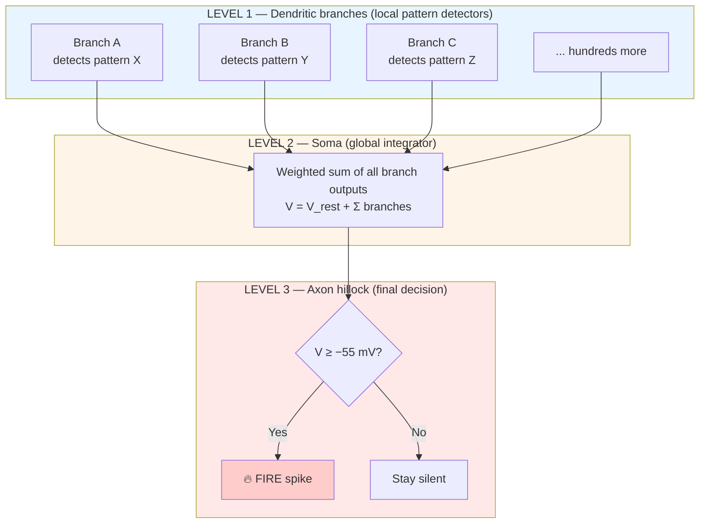

# Chapter 5: Computational Hierarchy

## The neuron is not a single computer — it's three

One of the biggest oversimplifications in textbook neuroscience (and in AI) is the idea that a neuron is essentially a weighted-sum-and-threshold device: inputs come in, get summed, threshold is checked, output goes out. This picture is the model underlying most artificial neural networks.

The real biological neuron is far richer. Computation happens at **three distinct levels**, each with different properties and timescales. Understanding this hierarchy is one of the places where brains and artificial neural networks diverge most visibly.

Here's the hierarchy at a glance:



**The key insight:** each dendritic branch is itself doing pattern recognition *before* the soma even sees anything. A single biological neuron contains hundreds of these mini-detectors running in parallel.

---

## Level 1: Local dendritic computation

Each dendritic branch can process its inputs independently at the 1–10 µm scale.

- Branches have their own **voltage-gated channels** built into their membranes.
- NMDA receptors (see [Chapter 4](04-learning-mechanisms.md)) can generate local **dendritic spikes** — small, localized bursts of activity — without involving the rest of the neuron.
- Active properties enable **nonlinear amplification**: a particular *pattern* of inputs arriving at one branch can trigger a much bigger response than the sum of its parts would predict.

**Think of it as:** each branch is a mini-neuron doing its own pattern recognition. A single pyramidal neuron in the cortex has hundreds of these branches running in parallel. Each one is, effectively, looking for a particular combination of inputs that it "cares about."

### Why this matters

Imagine a neuron that needs to recognize the pattern "A AND B AND C together, but not A AND D." A simple sum-and-threshold neuron can't do this reliably — it would weight each input, and the result would be easily confused by a strong enough A+D combination.

A neuron with active dendrites *can* do this. Branch 1 can be tuned to fire only when A, B, and C arrive together. Branch 2 can be tuned to ignore A+D. The soma then just integrates the branch outputs. The neuron has performed a computation that would require a small artificial network to simulate.

Estimates suggest a single pyramidal neuron has the computational complexity of a multi-layer perceptron with hundreds of units. That's *one* biological neuron.

---

## Level 2: Global soma integration

The soma receives the outputs of all the dendritic branches and sums them.

```
V(soma) = V(rest) + Σ(all branch contributions)
```

The integration has structure:

- **Temporal window:** only inputs within a 10–30 ms window get summed together.
- **Spatial weighting:** closer branches contribute more than far-away ones (because signals attenuate over distance).
- **Inhibition near the soma:** inhibitory (GABA) synapses placed near the soma can veto excitation from any direction.
- **Integration isn't linear:** complex interactions between simultaneous inputs can produce super- or sub-linear effects.

The result is a single number — the current voltage of the cell body — which feeds into the final decision.

---

## Level 3: Axon hillock — the final threshold detector

The axon hillock is the last stop before firing. It has:

- The **lowest threshold** in the neuron (about –55 mV vs –50 mV elsewhere).
- The **highest density of voltage-gated sodium channels** (50–100 per µm² vs 5–10 elsewhere).

When soma voltage reaches threshold, the hillock fires first, and the spike propagates down the axon. This is the neuron's final, **all-or-nothing decision.**

---

## Walking through an example

Let's trace a concrete case. Suppose one of your neurons is helping you recognize that a particular object rolling across the floor is a soccer ball. Here's what the hierarchy does:

**At the dendritic level** (Level 1):
- Branch A receives inputs encoding "round shape." If several round-shape signals arrive together, the branch generates a local spike.
- Branch B receives inputs encoding "black-and-white pattern." Similar story.
- Branch C receives inputs encoding "rolling motion." Another local spike.
- Other branches that receive mixed/noisy inputs stay quiet.

At this point, the neuron has already done a significant pattern-matching computation — *entirely within its own dendrites*. It has recognized three separate features in parallel.

**At the soma** (Level 2):
- The spikes from branches A, B, and C converge.
- They arrive within the 10–30 ms window, so they sum.
- Voltage at the soma climbs past threshold.

**At the axon hillock** (Level 3):
- Threshold crossed → spike fires.
- The neuron has now signaled: *"the combination of round + black-and-white + rolling has been detected."*

That one neuron's single output spike represents the result of dozens of parallel sub-computations done in its dendrites. Multiply by 86 billion neurons and you start to see why the brain is more than a big weighted sum.

---

## Why this matters for AI

Most artificial neural networks implement only Level 2 — a single weighted sum per "neuron," followed by an activation function. They don't have local branch computation. Everything is global.

To match the computational richness of one biological pyramidal neuron, an artificial network typically needs a small sub-network of 5–10 units. Which means the naive comparison — "the brain has 86 billion neurons, so a network with 86 billion units should match it" — is dramatically wrong. The brain's effective unit count, in artificial-neuron terms, might be closer to hundreds of billions or trillions, simply because each biological neuron does so much more.

This is one of several reasons artificial neural networks, despite impressive achievements, still struggle with tasks like commonsense reasoning and flexible generalization. The architectural expressiveness of dendritic computation is something current AI simply doesn't have.

---

## Closing thought

> When you read "the brain has about 86 billion neurons," it's easy to picture 86 billion tiny logic gates wired together. That's wrong in a fundamental way. Each of those neurons is itself a miniature network, with hundreds of branches each doing its own pattern recognition, feeding into a global integrator, which feeds a final threshold detector, which produces a single output spike.
>
> A neuron is not a node. It's a three-level computer embedded inside a node. And the full machine is 86 billion of these, all running in parallel, all tuning themselves continuously through experience.
>
> The wonder is not that you can think. The wonder is that such a system — so intricate, so recursive, so self-modifying — hangs together well enough to produce a single coherent thought at all.
