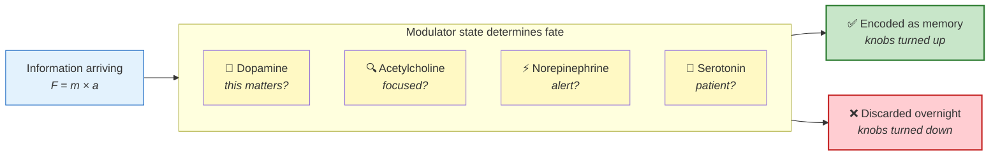

# Chapter 6: The Chemicals That Decide What You Remember

*Why the same study session, on two different days, can produce completely different results.*

> 📍 *Chapters 1–5 covered the architecture and machinery of how the brain processes signals. But there's a layer above all that — a small set of chemicals that don't carry information themselves but **decide what gets saved and what gets discarded**. They're the reason mood, sleep, and motivation aren't soft extras. They're chemistry.*

---

## A scene you've probably lived

Two students sit in the same physics class. Same teacher. Same equation on the board. Same explanation, same examples, same handouts.

A week later, one of them remembers the material clearly enough to teach it. The other has forgotten almost all of it.

What was different?

It wasn't the material. It wasn't the teacher. It probably wasn't even how hard each student tried.

What was different was **chemistry** — specifically, a small set of chemicals quietly flowing through their brains during that class, deciding what would stick and what wouldn't.

This chapter is about those chemicals.

---

## The system that decides what your brain saves

Alongside the information flowing through your brain at any moment, another set of signals is flowing too. They're called **neuromodulators**. There are a handful of them, each doing a specific job, and together they decide which of the millions of moments hitting your brain right now will leave a mark.

Modulators are surprisingly few. Out of your 86 billion neurons, fewer than **one in a thousand** make modulator chemicals. But each of those neurons projects widely — a single dopamine neuron can influence a hundred thousand others. So a tiny population of cells, deep in the brainstem and midbrain, controls what billions of cortical neurons treat as important.

Visualized — tiny source, vast reach:

```
                ┌─────────────────────────────────┐
                │       CORTEX (the big stuff)    │
                │                                 │
                │   Billions of neurons —         │
                │   the seeing, deciding,         │
                │   remembering, thinking         │
                │                                 │
                │   ▲ ▲ ▲ ▲ ▲ ▲ ▲ ▲ ▲ ▲ ▲ ▲ ▲   │
                │   │ │ │ │ │ │ │ │ │ │ │ │ │   │
                │   │ │ │ │ │ │ │ │ │ │ │ │ │   │
                │   │ │ │ │ │ │ │ │ │ │ │ │ │   │
                │   ◄─── projections ───────►    │
                │   (each modulator neuron       │
                │    reaches ~100,000 targets)   │
                └────────────┬────────────────────┘
                             │
                             │  modulator chemicals
                             │  shower upward
                             │
                ┌────────────┴────────────┐
                │   BRAINSTEM + MIDBRAIN  │
                │                         │
                │   Dopamine    ●●●  (~400K neurons)
                │   ACh         ●●●  (~300K neurons)
                │   Norepinephrine ●●  (~50K neurons)
                │   Serotonin   ●●●  (~250K neurons)
                │                         │
                │   Total: ~1 million neurons
                │   (out of 86 billion — that's
                │    1 in 86,000 of your neurons)
                └─────────────────────────┘

   Tiny source, vast reach. A handful of cells decide
   what billions of cortical neurons treat as important.
```

You're born with these systems pre-built. You don't have to learn how to use dopamine — it just works. What changes during your life is the *content* (the glutamate networks encoding F = ma, your mother's face, how to ride a bike). The modulator systems are the unchanging tools that shape what gets saved into that content.

There are four big ones. Here they are at a glance — then we'll meet each in detail:

```
┌──────────────────┬──────────────────┬──────────────────┬──────────────────┐
│   🎯 DOPAMINE    │   🔍 ACETYLCHOLINE│   ⚡ NOREPINEPHRINE│   🧘 SEROTONIN  │
│                  │                  │                  │                  │
│  "this matters"  │   "focus here"   │    "wake up"     │  "stay with it"  │
│                  │                  │                  │                  │
│  The reward tag. │  The attention   │  The alertness   │  The patience    │
│  Marks synapses  │  sharpener.      │  baseline.       │  chemistry.      │
│  for memory.     │  Quiets noise,   │  Sets how        │  Tolerance for   │
│                  │  amplifies the   │  responsive your │  confusion and   │
│                  │  signal you're   │  whole brain     │  repeated        │
│                  │  attending to.   │  is right now.   │  failure.        │
│                  │                  │                  │                  │
│  Felt as:        │  Felt as:        │  Felt as:        │  Felt as:        │
│  the spark of    │  the room going  │  snapping to     │  willingness to  │
│  *yes!*          │  quiet around    │  full alert      │  try one more    │
│                  │  a hard book     │                  │  attempt         │
│                  │                  │                  │                  │
│  Boosted by:     │  Boosted by:     │  Boosted by:     │  Boosted by:     │
│  curiosity,      │  single-tasking, │  light exercise, │  good sleep,     │
│  reward,         │  no distractions │  morning light   │  outdoor time,   │
│  meaning         │                  │                  │  exercise        │
│                  │                  │                  │                  │
│  Crashed by:     │  Crashed by:     │  Crashed by:     │  Crashed by:     │
│  boredom, dread  │  multitasking    │  exhaustion OR   │  chronic stress, │
│                  │                  │  too much caffe. │  poor sleep      │
└──────────────────┴──────────────────┴──────────────────┴──────────────────┘
```

Now meet each one in depth.

---

## Meet the four modulators

### Dopamine — the "this matters" signal

Think of the moment you nailed a presentation. Or solved a hard problem after struggling with it for an hour. Or got an unexpected compliment that lit you up. That little spark of *yes!* you felt — that's dopamine arriving.

It's not just a feel-good chemical. **It's a tag.** When dopamine releases, every synapse that happens to be active in that moment gets a marker stamped on it: *this was important — consolidate me*.

When you study something with genuine curiosity, dopamine is what makes the material stick. When you study from dread or boredom, dopamine is absent — and the same material slides off the brain like rain off glass.

Practically: you've probably noticed that you remember conversations from exciting evenings far better than conversations from boring ones, even if the boring ones contained more information. That's dopamine choosing what to save.

### Acetylcholine — the focus signal

Picture sitting down to read something genuinely difficult. The first paragraph requires effort. Your eyes have to slow down. The room gets quieter. You can almost feel your attention narrowing onto the page.

That sharpening is **acetylcholine**. It makes neurons across the brain more responsive to whatever signal is coming in *right now*, while quieting their response to noise. It's the chemical of "pay attention to this, ignore everything else."

When acetylcholine is high, you encode what's in front of you in vivid detail. When it's low — when you're tired, distracted, scrolling on autopilot — your neurons fire more sluggishly and less of what you experience leaves a trace.

Practically: this is why genuinely focused study (no phone, no music with lyrics, no half-listening) creates memories that distracted study can't. Same minutes spent — vastly different acetylcholine — vastly different result.

### Norepinephrine — the alertness signal

Think of the moment a sudden noise makes you snap upright. Or the surge that hits when you realize you have ten minutes to leave for an appointment. The whole brain seems to wake up. That's **norepinephrine**.

Where acetylcholine sharpens specific attention, norepinephrine sets the *baseline volume* of the brain — how responsive everything is, how alert you feel, how quickly signals propagate.

Too low and you're foggy, drowsy, half-present. Too high and you're anxious, jittery, unable to sit with a single thought. The sweet spot — the calm-but-engaged state — is where most good learning happens.

Practically: a 10-minute walk before a study session boosts norepinephrine and makes the next hour measurably more productive. Heavy caffeine spikes it too high and the gains disappear into restlessness.

### Serotonin — the patience signal

Imagine you're stuck on a problem. The first attempt fails. You try again — also fails. A third approach — still nothing.

What decides whether you stay with it for one more attempt or get up and walk away? In large part, it's **serotonin**.

Serotonin doesn't make you happy. It makes you *able to tolerate discomfort* — the discomfort of confusion, of not-yet-understanding, of repeated failure. It's the chemistry of persistence.

When serotonin is healthy, hard problems feel like puzzles. When it's depleted (chronic stress, poor sleep, depression), the same problems feel like walls and you give up sooner. The material isn't harder. Your willingness to stay in it is lower.

Practically: this is why learning slows so dramatically during periods of high stress. The cortex is fine. What's missing is the chemistry that lets you persist long enough for understanding to form.

---

## How they work together

The four modulators aren't independent. They overlap, balance, and amplify each other. Here's the picture — the same information entering one neuron, passing through the four modulator influences, ending up either saved or discarded:



Three quick scenarios show how dramatic the effect can be:

| State | What happens to today's learning |
|-------|----------------------------------|
| Bored, distracted, tired | Reaches the brain. Almost nothing is saved. |
| Engaged, motivated | Synapses get tagged. A real memory forms. |
| Focused + curious + rested + calm | Strong learning. Often the "I'll never forget this" feeling. |

(The molecular mechanism by which "tagging" turns into actual synaptic strengthening is in [Chapter 4](04-learning-mechanisms.md).)

---

## Why this matters in real life

This is the chapter's practical payoff. Mood, focus, rest, and motivation aren't soft extras you should worry about *after* you've optimized your study technique. **They're the chemistry of whether your study technique works at all.**

You can have a perfect study plan, a quiet room, the right textbook, and three hours of free time. If your modulator systems are flat — if you're depressed, exhausted, anxious, or just deeply uninterested — almost none of that material will survive the night.

Conversely, you can have a noisy environment, mediocre material, and an interrupted hour. If you're lit up by genuine curiosity, well-rested, and calmly persistent, you can come away with permanent learning.

The implication isn't *try harder*. The implication is *get the chemistry right first*. Sleep. Move your body. Find something to actually care about in the material. Manage chronic stress. These aren't lifestyle wellness tips — they're the prerequisites for learning to even occur.

---

## Closing thought

> The most consequential thing about neuromodulators is how small they are — about one in a thousand neurons — and how much they decide. A handful of cells deep in the brainstem and midbrain, firing chemicals into vast territories of cortex, decide whether the billions of glutamate signals flowing through your brain right now will be amplified into memory or discarded as noise.
>
> This explains an asymmetry you have probably lived: two study sessions with the same material can produce utterly different results. One leaves you sharper a week later; the other leaves no trace. The difference usually wasn't the material or your effort. It was chemistry — specifically, whether the modulator systems were turned on or off while you worked.
>
> You cannot will yourself to have high dopamine or sharp acetylcholine. But you can set up conditions — adequate sleep, physical activity, genuine interest, manageable stress — that make the modulator systems do their job.
>
> If you want to learn well, don't just study harder. **Study when your chemistry is willing to cooperate.**

---

> *We've now covered all the machinery: the cells, the spike, the synapse, the cascade, the dendritic computation, the modulator chemistry. With all of that in place, we can finally separate four words people use as if they meant the same thing — and that confusion runs through every conversation about minds, brains, and AI. That's [Chapter 7](07-understanding-intelligence.md).*
