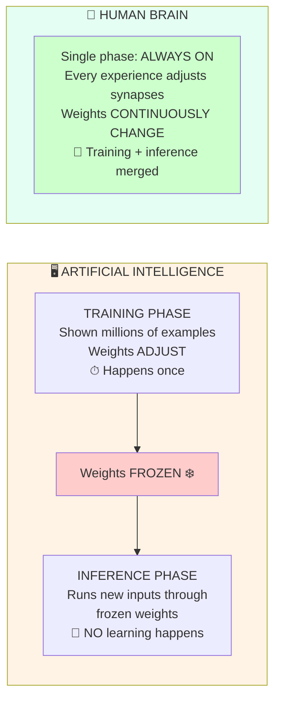

# Chapter 8: Brain vs Artificial Intelligence

## What current AI captures — and what it misses

Artificial neural networks are inspired by biology, but the inspiration is loose. Understanding what's actually captured and what's ignored helps you think clearly about AI claims.

---

## What AI captures (~5%)

- **Networks of units with weighted connections** — a rough abstraction of neurons and synapses.
- **Activation functions** — a simplified version of the firing threshold.
- **Gradient descent / backpropagation** — a mathematical way to adjust weights, loosely analogous to learning.
- **Hierarchical representations** — early layers detect simple features, later layers detect complex patterns (similar to visual cortex hierarchy V1 → V2 → IT).

That's a real and useful abstraction. It's enough to do a lot of impressive things.

---

## What AI omits (~95%)

### Molecular & cellular mechanisms
- **Chemical signaling** — no neurotransmitters, no synaptic vesicles, no release probability.
- **Temporal dynamics** — no action potential timing, no refractory periods, no EPSP decay.
- **Gene expression** — no long-term structural changes triggered by learning.
- **Metabolic constraints** — no energy budget (biological learning costs ATP).

### Architectural features
- **Dendritic computation** — no local nonlinear processing at branches.
- **Neuromodulation** — no dopamine-like signal flagging importance, no attention-gating acetylcholine analog.
- **Continuous plasticity** — AI weights are frozen at deployment. (See [Chapter 4](04-learning-mechanisms.md) for how biological plasticity actually works.)

### Higher-level properties
- **Embodiment** — no physical body grounding concepts.
- **Intrinsic motivation** — no curiosity, no drive beyond the loss function.
- **Common sense** — the kind of world-model humans acquire from physical experience.

---

## The crucial distinction: training vs inference

This is the single most important thing to understand about current AI. The picture:

**The key difference:** AI has two separate modes — learning mode (training) and using mode (inference). Your brain doesn't. Every moment of your life is both using what you know *and* quietly updating what you know. There is no "deployed, frozen" version of you.

| | Training | Inference |
|---|---|---|
| When | In the past, one-time (or periodic) | Right now, in conversation |
| What changes | Weights change | **Nothing changes** — weights are frozen |
| Analog in the brain | Learning | Thinking without learning |

**"Does this AI learn from our conversation?"**

For most deployed AI systems today, the answer is **no**. The model was trained on a huge dataset. Now it's running inference — using its frozen weights to process new inputs. Your conversation does not modify the model's weights.

**Your brain, by contrast, is learning right now, reading this sentence.** New synapses are forming. Existing ones are strengthening. The distinction between "training mode" and "inference mode" doesn't exist for you — you're always doing both.

This is a fundamental architectural difference, not a temporary limitation.

---

## Why this matters

- You won't be fooled by marketing that claims AI "thinks like a human" or "learns like a brain."
- You can recognize genuine advances. When systems start incorporating neuromodulation-like gating, continuous plasticity, or dendritic-style local computation, that's when the analogy gets closer to real.
- You can reason clearly about where AI is likely to struggle (common sense, embodied reasoning, real-time adaptation) vs where it excels (pattern recognition at scale, processing speed).

---

## The mental model to carry forward

**Current AI is a powerful static function approximator.** It's extraordinarily good at pattern matching within the distribution it was trained on. That's not a small thing — it's enough to do translation, generation, recognition, and reasoning at near-human levels in many domains.

**A biological brain is a continuously self-modifying physical system** grounded in a body, shaped by evolution, powered by metabolism, and running on molecular machinery that AI doesn't simulate.

Both are real. Neither is a perfect substitute for the other. The interesting question isn't "which is better?" but "what would a system that combines the strengths of both look like?"
