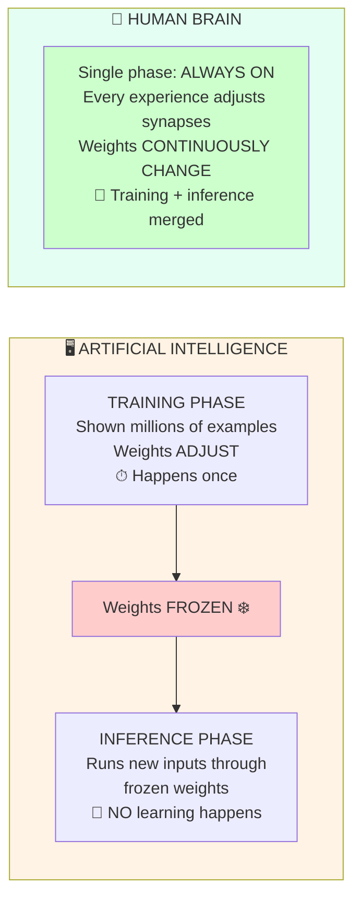

# Chapter 8: Brain vs Artificial Intelligence

*Why the most advanced AI on Earth still doesn't do what your brain does — and won't, until something fundamental changes.*

> 📍 *You've reached the chapter the rest of the guide was building toward. With seven chapters of biology in your head — neurons, signals, synapses, learning, modulators, intelligence — you now have the foundation to look at modern AI and see, clearly, what it captures and what it doesn't. This is the comparison you came here for.*

---

## The question this whole guide was leading to

If you've read this far, you've been building toward a comparison.

You now know what a real biological brain is doing. The action potentials. The chemical synapses. The calcium cascades. The neuromodulators deciding what gets saved. The dendritic branches doing parallel pattern recognition. The continuous physical change that is learning.

So when someone tells you that AI is "modeled on the brain" or "learns like humans" or is "approaching general intelligence" — you finally have the foundation to ask the right question:

> **How much of what a brain actually does is current AI doing?**

The honest answer is: **about 5%.** The other 95% is missing — and not in a way that adding more compute or more parameters will fix. Some of what's missing is structural. Some of it requires continuous physical self-modification. Some of it depends on having a body.

This chapter walks through what's captured, what isn't, and why the difference matters.

---

## What AI does capture (the 5%)

To be fair, the borrowing from biology is real. Modern AI systems implement:

- **Networks of units with weighted connections** — a rough abstraction of neurons and synapses.
- **Activation functions** — a simplified version of the firing threshold.
- **Gradient descent / backpropagation** — a mathematical method for adjusting weights, loosely analogous to learning.
- **Hierarchical representations** — early layers detect simple features, later layers detect complex patterns. (This actually does mirror how the visual cortex works: V1 → V2 → V4 → IT.)

That's a real and useful abstraction. It's enough to translate languages, generate images, write code, beat humans at games, and recognize objects in photos — sometimes at superhuman levels.

So when AI works well, it really is doing something brain-like. The question is what it's *not* doing.

---

## What AI omits (the 95%)

Three categories. Each contains things current AI simply has no equivalent for.

### Molecular and cellular mechanisms — none of it

- **Chemical signaling.** AI has no neurotransmitters. No vesicles, no release probability, no diffusion across a cleft. Just numbers being multiplied.
- **Temporal dynamics.** AI has no action potential timing, no refractory periods, no EPSP decay over 5–20 ms. It processes inputs in discrete forward passes — no continuous time.
- **Gene expression.** Biological learning triggers protein synthesis that takes hours to days. AI has no equivalent. Once trained, nothing inside the model rebuilds itself.
- **Metabolic constraints.** Real brains run on 20 watts and have to budget energy. AI runs on whatever electricity you can throw at it. This sounds like a feature for AI, but the constraint is what forced biological brains to evolve sparse, efficient coding.

### Architectural features — partially missing

- **Dendritic computation.** Real neurons do parallel local pattern recognition in their dendrites *before* the cell body sums anything (see [Chapter 5](05-computational-hierarchy.md)). AI's "neurons" are single weighted sums — no local computation at all. To match one biological neuron, you need 5–10 artificial ones.
- **Neuromodulation.** No dopamine equivalent flagging "this is important." No acetylcholine sharpening attention. No serotonin enabling persistence. (See [Chapter 6](06-neuromodulation.md) for what these do.) AI has crude analogs (attention mechanisms, reward signals in RL) but nothing as rich as the brain's four-modulator system.
- **Continuous plasticity.** Biological synapses change with every experience. AI weights are frozen at deployment. This is the biggest gap of all — explained in detail below.

### Higher-level properties — not even close

- **Embodiment.** Your concepts are grounded in physical experience. You know what "heavy" means because you've lifted things. AI knows what "heavy" means because it's a word that appears near other words. These are not the same kind of knowing.
- **Intrinsic motivation.** Curiosity. The drive to explore for its own sake. AI has none of this. It optimizes whatever loss function you give it, then stops.
- **Common sense.** The vast world model humans build by being alive in the world for years. AI gets glimpses of this through training data but can't reliably reason about everyday physical situations.

---

## The single biggest gap: training vs inference

If you remember only one thing from this chapter, make it this:

AI has two completely separate modes:

| | Training | Inference |
|---|---|---|
| **When** | In the past, one-time (or periodic re-trainings) | Right now, when you use the model |
| **What changes** | Weights adjust based on examples | **Nothing changes** — weights are frozen |
| **Brain analog** | Learning | Thinking without learning |

Your brain doesn't have these two modes. It has one mode, all the time. **Every moment of your life, you are simultaneously using what you know AND updating what you know.** Reading this sentence is changing your synapses right now. There is no "deployed, frozen" version of you.

### "Does this AI learn from our conversation?"

For almost all deployed AI systems today: **no.**

The model was trained months or years ago on a huge dataset. Now it's running inference — pushing your input through frozen weights to produce an output. Your conversation does not modify the model. Tomorrow's user will get a model identical to today's.

(Some systems have memory features that store recent conversation in a database — but that's not the model learning. It's just additional input being fed back in. The actual weights stay frozen.)

This isn't a temporary limitation. It's a fundamental architectural difference.

---

## What the gap means for AI claims

Now you can hear AI claims with a sharper ear.

**"AI is becoming intelligent"** → Which kind of intelligence? Pattern matching at scale (yes, dramatically). Continuous learning (no). Embodied common sense (mostly no). Genuine novel reasoning (often no, sometimes yes).

**"AI thinks like a human"** → It does similarity-based pattern completion, which can superficially resemble thinking. It doesn't have continuous self-modification, embodied experience, or the chemistry that makes biological cognition feel like anything from the inside.

**"Soon AI will surpass humans"** → On specific narrow tasks, often already true. On the full general capability of a continuously-learning, embodied, motivated mind: still very far.

**"AI is conscious"** → Almost certainly not, in any meaningful biological sense. Consciousness probably requires the kind of continuous self-modification, body grounding, and chemistry-mediated state that current AI architectures don't have.

**"AI will keep improving exponentially"** → On the things current architectures can do, yes. On the things current architectures can't do at all (continuous plasticity, common sense, embodied reasoning), adding more compute doesn't help. These need new architectures, and there's no clear path to them yet.

---

## The honest summary

> **Current AI is a powerful static function approximator.** Once trained, it processes inputs and produces outputs — extraordinarily well, within the distribution it was trained on. That's not a small thing. It's enough to do translation, generation, recognition, and reasoning at near-human levels across many domains.
>
> **A biological brain is a continuously self-modifying physical system** — grounded in a body, shaped by evolution, powered by metabolism, running on molecular machinery, modulated by chemistry, and learning every moment it's alive.
>
> Both are real. Neither is a perfect substitute for the other.
>
> The interesting question isn't "which is better?" It's "what would a system that combines the strengths of both look like?" And until AI architecture incorporates continuous plasticity, neuromodulation-like gating, and embodied grounding, that hybrid system doesn't yet exist.
>
> When future AI begins to learn during deployment, when it has chemistry-like global modulation, when it's grounded in a body — that will be a genuinely new era. For now, you understand the original.

---

> *That's the conceptual climax. From here, the rest of the guide shifts from "what is the brain?" to "how do you actually use this knowledge?" Three chapters serve that goal: [Chapter 9](09-mental-models.md) gives you compact mental models for holding everything you've learned; [Chapter 10](10-sleep-memory-forgetting.md) deepens the practical material on memory and sleep; [Chapter 11](11-applying-the-science.md) is the cash-out — ten study techniques that work because they match the biology. (And the [Quick Reference appendix](appendix-quick-reference.md) sits at the very end, for when you need to look up specific numbers.)*
