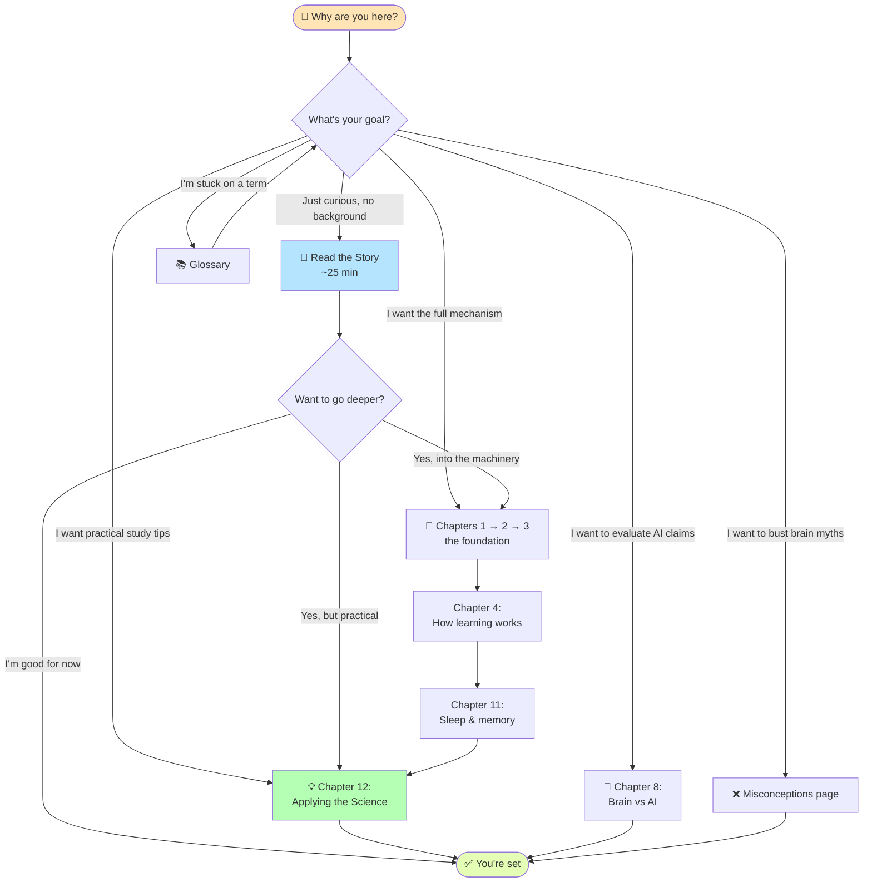

# The Brain Bible: A Complete Neuroscience Guide

> A mechanistic, first-principles guide to how the biological brain computes, learns, and understands — with **F = ma** used as a running example throughout.

This guide is written for curious readers of any background. You don't need a biology degree. If you can follow an analogy and sit with an equation, you can follow this.

> 👋 **New here? Start with [Background: Why This Guide Exists](Background.md).** It explains the reasoning behind learning about the brain first — especially if your eventual goal is understanding AI — and sets up the rest of the material.

---

## Why this guide exists

Most neuroscience explanations stop at metaphors ("neurons are like wires", "memory is like a filing cabinet"). This guide goes deeper — down to the ion channels, the calcium cascades, the gene expression, the physical growth of dendritic spines — and shows *how* the brain actually does what it does.

The goal: build a mental model of biological intelligence strong enough that you can critically evaluate claims about artificial intelligence, learning science, and cognition.

---

## How to read this

It's a **reference**, not a novel. Jump to whatever section interests you. Each chapter stands alone, but concepts do build on each other in order.

### Pick your path

**Or just text-only, if you prefer:**
- **Completely new? Start here → [The Brain, Told as a Story](The-Brain-Story.md).** A plain-English narrative — no jargon, no tables. Read it first; then come back to the technical chapters.
- **New to neuroscience?** Read chapters 1 → 2 → 3 in order to get the physical foundation.
- **Curious about learning?** Jump to chapters 4, 7, 11, and 12.
- **Want practical study tips?** Go straight to chapter 12.
- **Comparing brain to AI?** Chapter 8.
- **Want the short version?** Chapter 10 (quick reference).
- **Stuck on a term?** Check the [Glossary](Glossary.md).

---

## Table of Contents

| # | Chapter | Read | What you'll learn |
|---|---------|------|-------------------|
| — | [Background: Why This Guide Exists](Background.md) | ~8 min | The motivation, the approach, and an honest caveat. **Read this first.** |
| ★ | [The Brain, Told as a Story](The-Brain-Story.md) | ~25 min | The whole guide as a plain-English narrative. Best first deep-read. |
| 1 | [The Biological Neuron](01-biological-neuron.md) | ~12 min | The components of a neuron and how information flows through one |
| 2 | [Neural Communication](02-neural-communication.md) | ~10 min | How action potentials work — the 6-phase electrical spike |
| 3 | [Synaptic Transmission](03-synaptic-transmission.md) | ~10 min | The 9-step electrical → chemical → electrical handoff between neurons |
| 4 | [Learning Mechanisms](04-learning-mechanisms.md) | ~15 min | How neurons physically change when you learn (Hebb's law, NMDA, LTP, sleep, spacing) |
| 5 | [Computational Hierarchy](05-computational-hierarchy.md) | ~8 min | Local dendritic computation vs global soma integration |
| 6 | [Neuromodulation Systems](06-neuromodulation.md) | ~10 min | How dopamine, acetylcholine, norepinephrine, and serotonin act as "knobs" |
| 7 | [Understanding & Intelligence](07-understanding-intelligence.md) | ~18 min | The real difference between learning, knowledge, understanding, and intelligence |
| 8 | [Brain vs Artificial Intelligence](08-brain-vs-ai.md) | ~6 min | What AI captures (~5%) and what it misses (~95%) |
| 9 | [Mental Models](09-mental-models.md) | ~12 min | Five useful analogies: buckets, knobs, tools vs content, trucks, city |
| 10 | [Quick Reference](10-quick-reference.md) | skim | Numbers, timescales, equations, troubleshooting |
| 11 | [Sleep, Memory & Forgetting](11-sleep-memory-forgetting.md) | ~15 min | Types of memory, consolidation, why we forget, reconsolidation |
| 12 | [Applying the Science](12-applying-the-science.md) | ~15 min | Ten practical study strategies, each with its neural mechanism |
| — | [Common Misconceptions](Misconceptions.md) | ~10 min | Popular myths about the brain and what the science actually says |
| — | [Glossary](Glossary.md) | skim | Plain-English definitions of every technical term, alphabetical |

**Full guide, front-to-back:** roughly 3 hours of focused reading.
**The Story + Applying the Science:** about 40 minutes and gives you 80% of the practical value.

---

## Core ideas you'll take away

1. **Structure IS information.** Your knowledge isn't stored in the brain — it *is* the physical pattern of synaptic connections.
2. **Learning is construction.** New knowledge requires growing new spines, inserting new receptors, and synthesizing new proteins. It takes time.
3. **Understanding is a network property.** Isolated facts don't become understanding until they get interconnected.
4. **Modulators are tools, content is learned.** The brain ships with pre-built amplifier systems (dopamine, etc.) and fills in content through experience.
5. **Chemical synapses enable learning.** The slight delay of chemical transmission is the price the brain pays for plasticity — and it's worth it.

---

## The running example: F = ma

Throughout the guide, we trace how a single piece of knowledge — Newton's second law, *force = mass × acceleration* — is physically encoded, learned, and understood in the brain. Using one concrete example across every chapter shows how the same neural machinery supports everything from seeing an equation on paper to deeply understanding physics.

---

*Originally adapted from "The Ultimate Brain Bible" — restructured as a multi-file reference for general readers.*
