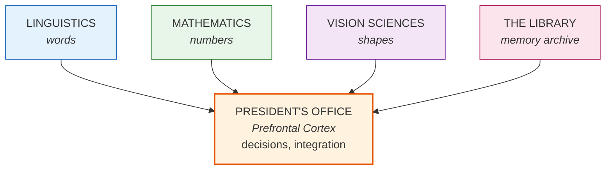
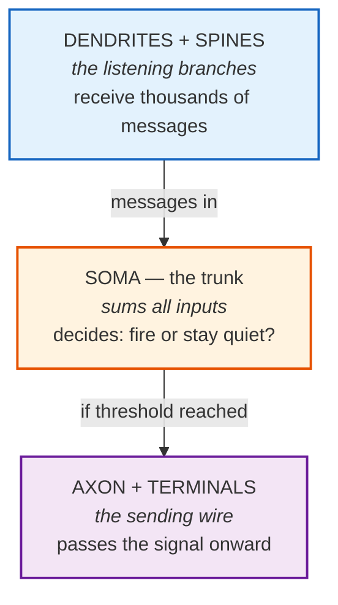
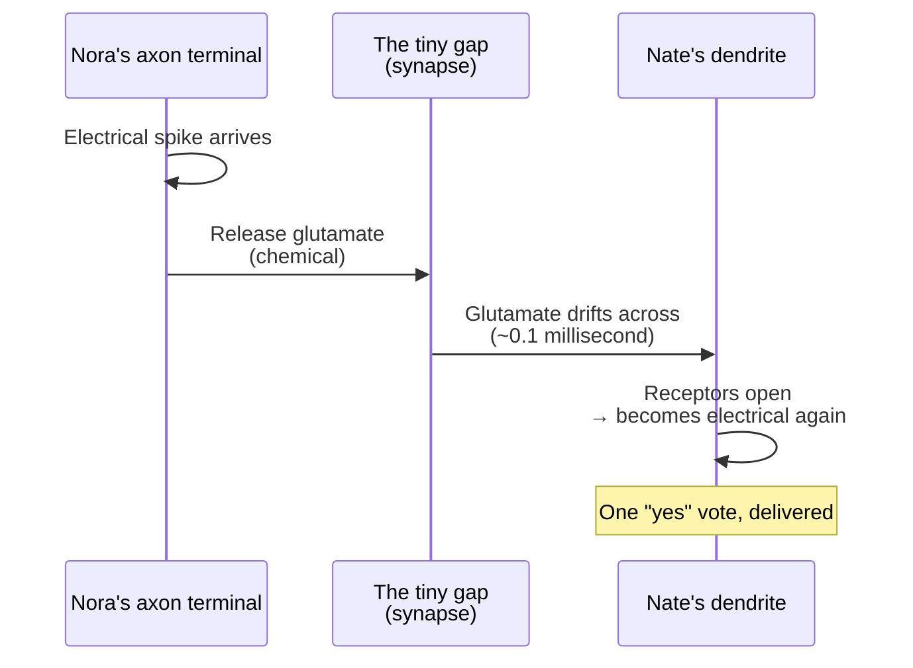
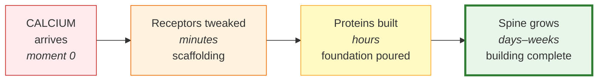
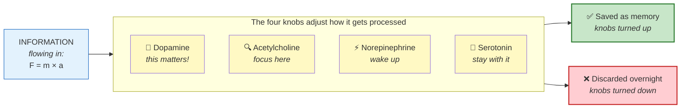
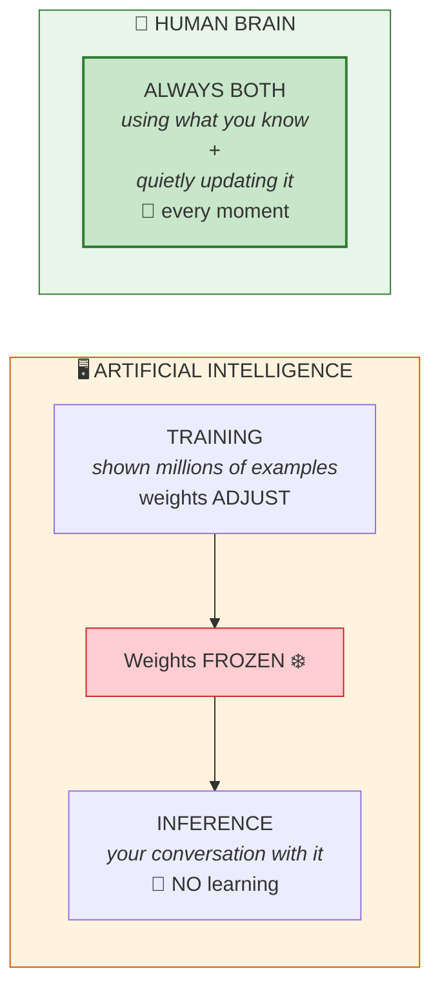

# The Brain, Told as a Story

*A plain-English tour of how your head actually works. No biology background required. Read it start to finish — it's meant to flow.*

---

## Prologue: The question that started everything

By the end of this story, you'll understand something most people never do — what's actually happening inside your skull when you learn.

Not metaphorically. Physically. Down to the molecule.

You'll also understand, at the end, something more provocative: why the most advanced AI systems on Earth today *don't* do what your brain does — and why that's not a temporary limitation. But that's the last chapter. First, we need to follow someone who's learning.

---

It's a Tuesday afternoon. A physics teacher writes three symbols on the board:

> **F = m × a**

A student in the back row — let's call her Maya — reads it. Nothing happens at first. Then, over the next few weeks, something extraordinary unfolds inside her skull. Tiny structures grow. Chemicals are released in precise sequences. Roads are paved between neighborhoods she didn't know existed.

By the end of the month, Maya *understands* what force, mass, and acceleration mean. She can use the equation. She can explain it to her little brother. She can apply it to a rocket, a shopping cart, a car accident.

This guide is the story of what happened in Maya's head. The good news: it's the same story happening in yours, right now, as you read this sentence.

---

## Chapter 1: The university inside your head

Picture your brain as a vast university campus.

A sprawling one. **86 billion buildings** — every classroom, lab, library wing, dorm, and admin office. They're connected by **trillions of walkways** that ideas, signals, and messages travel along.

- Each building is a **neuron** — a single brain cell.
- Each walkway is a **synapse** — where one neuron passes a message to the next.

Like a real university, this campus has departments. And unlike most city neighborhoods, each department genuinely specializes:

- **Vision Sciences** — at the back of campus, processing everything you see.
- **Linguistics** — on the left side of campus, handling words and meaning.
- **Mathematics** — dealing in numbers, equations, quantities.
- **The Library** — your memory archive, where every experience gets filed away so you can find it again.
- **The President's Office** — up front. The Prefrontal Cortex. Where decisions get made and the work of every other department ties together.

*All departments connected by trillions of walkways (synapses). Some walkways well-traveled, others barely used. **Every time you learn something, new walkways get built.***

When Maya read "F = m × a", the symbols entered her campus through her eyes. What happened next is a chase — the message travels from department to department, leaving tiny changes wherever it goes. Those changes, accumulated over days and weeks, are her new knowledge.

Let's follow one of those messengers.

---

## Chapter 2: A day in the life of one neuron

Meet Nora, a single neuron.

Nora has an elaborate shape. Think of her as a tree. She has thousands of tiny branches reaching upward — these are her **dendrites**. They're her antennas, covered in little bumps called **spines** where incoming messages land.

At the bottom of the tree is the **trunk** — her cell body. And from the trunk, a single long wire extends outward — her **axon**. The axon can be as short as a fraction of a millimeter or, for some neurons, as long as a full meter. At the far end, the axon branches out again into thousands of little endings called **terminals**. Each terminal is a post office where Nora sends messages to other neurons.

So Nora receives on her branches, thinks in her trunk, and sends through her wire. Simple enough.

Except not really.

### The arithmetic of a neuron

At any moment, thousands of other neurons are sending messages to Nora. Some are whispering "yes, yes, fire a signal!" Others are saying "no, quiet down." These messages arrive at different branches, at different times, with different intensities.

Nora's job is to add them all up. She literally does arithmetic. She takes all the "yes" votes, subtracts all the "no" votes, and checks: **did the total cross the line?**

If it did, she fires a single electric spike — an **action potential** — that races down her axon to her terminals, where it gets passed on to the next neurons.

If it didn't, she waits. The moment passes. No signal sent.

That's it. That's what one neuron does. Billions of times a second, across a hundred billion neurons, this tiny decision — fire or don't fire? — is happening. And somehow, from that, consciousness emerges.

### The spike

Let's slow down and watch Nora fire.

Her trunk is sitting at a slight negative charge compared to the outside world. (Think of it like a tiny, weak battery.) Positive messages from her branches nudge her charge upward. Negative messages push it down.

When enough "yes" messages arrive close together, her charge climbs. Climbs. Climbs. And at a very specific level — right at the edge — something gives way.

Tiny gates in her membrane called **sodium channels** fly open. Positive particles (sodium ions) rush in from outside. Her charge, which was climbing slowly, now *shoots upward* in a fraction of a millisecond. A spike has begun.

Then, almost immediately, potassium channels open. Positive particles rush back out. Her charge crashes back down, overshoots slightly, and settles.

The whole thing — from "I'm about to fire" to "done" — takes about two thousandths of a second.

That spike, once born, doesn't travel as a whisper down her axon. It regenerates itself at every point along the wire, like a row of dominoes knocking each other down. No matter how long her axon is, the spike arrives at the end at full strength.

Nora just sent a message.

---

## Chapter 3: Where one neuron meets another

Her message now needs to reach the next neuron. Call him Nate.

Here's the strange part: **Nora's axon doesn't actually touch Nate's dendrite.** There's a tiny gap between them. A gap so small you could fit maybe three hundred of them across the width of a human hair. But it's a gap nonetheless.

How does the message cross?

It stops being electricity. It becomes a chemical.

### The handoff

When Nora's spike arrives at a terminal, a cascade of events unfolds in under a thousandth of a second:

1. A kind of molecular gate opens, and calcium ions flood into the terminal.
2. The calcium is a signal: *release the cargo.*
3. Tiny bubbles inside the terminal — called **vesicles** — lurch toward the membrane. Each bubble contains roughly ten thousand molecules of a chemical called **glutamate**.
4. The bubbles merge with the outer wall and burst, spilling their glutamate into the gap.
5. The glutamate drifts across the gap. It doesn't take long — the gap is tiny.
6. On the other side, on Nate's dendrite, special molecules called **receptors** are waiting. Glutamate fits into them like a key into a lock.
7. When the glutamate locks in, the receptors open small channels. Positive particles rush into Nate.
8. Nate's charge nudges upward.

That's one "yes" vote, delivered.

The whole journey — electricity to chemistry to electricity again — takes about half a thousandth of a second. But in that tiny moment lies the most important feature of the brain: **the gap can change**.

Nora can learn to release more chemical. Nate can grow more receptors. The handoff can get stronger, or weaker, or disappear entirely. If Nora were connected directly to Nate by a wire, the strength would be fixed. But because there's a chemical gap in the middle, the connection is *negotiable*. It's tunable.

**That is why you can learn.**

If neurons were wired together instead of chemically connected, you'd come out of the womb with a fixed brain and die with the same one. Instead, your brain spends its entire life tweaking the strengths of those hundreds of trillions of gaps — and each tweak is a memory, a skill, a scrap of understanding you didn't have the day before.

---

## Chapter 4: The moment a memory is born

Now back to Maya and F = m × a.

The teacher writes the equation. Photons bounce off the chalkboard, enter Maya's eyes, and set off an electrical chain reaction that races through her Vision District, up into her Language District (where the letters "F", "m", "a" get meaning), and into her Math District (where the multiplication sign becomes an operation).

Many neurons in many districts are firing nearly at the same time. And among them, something special happens.

### The coincidence detectors

Nate — one of our neurons, tucked somewhere in Maya's prefrontal cortex — has a particular kind of receptor on one of his dendrites. It's called **NMDA**. Ordinary receptors open whenever glutamate arrives. NMDA receptors are pickier. They demand two things at once:

1. Glutamate must arrive (someone sent a message), **and**
2. Nate himself must already be firing (he, too, is active right now).

Only when *both* conditions are true does the NMDA receptor open. When it does, calcium — the same calcium that triggered release back in Nora's terminal — floods into Nate's dendrite.

Calcium, in this context, is a **learning signal**. It says: *this connection just happened at a moment that mattered. Strengthen it.*

### The famous rule

The Canadian psychologist Donald Hebb summarized this in 1949 with a sentence that's now carved into every neuroscience textbook:

> # Neurons that fire together, wire together.

NMDA receptors are how that rule is physically implemented. They're the coincidence detectors that notice which neurons were active at the same moment — and mark those specific connections for strengthening.

### What calcium does

The calcium rush sets off a chain of events that unfolds over different time scales, like a construction project.

**In the first few minutes,** existing receptors get temporarily tweaked. The connection feels a little stronger. But it's fragile — like scaffolding on a worksite.

**Over the next hour or two,** proteins get manufactured. New receptors get shuttled into place. The connection strengthens further, more durably. Foundation is being poured.

**Over days and weeks,** the dendritic spine itself grows bigger. Its cytoskeleton remodels. The whole structure physically changes. What was a dirt path is now a proper paved road.

This is why cramming doesn't work the way you hope. The first few minutes of a cram session activate scaffolding that hasn't even begun turning into foundation yet. Pull an all-nighter and then sleep for twelve hours, and some of it consolidates. Skip the sleep and go straight into a test, and most of what you "learned" was still scaffolding, waiting for proteins that never got made.

Learning, in the deep sense, takes **weeks**. You can accelerate it a little, but you can't skip the construction time.

When Maya leaves class that Tuesday, she has no sense that anything has happened. No flash of insight. No feeling of mastery. She walks to the bus stop, texts a friend, forgets about physics. But inside her skull — in a handful of neurons she'll never consciously meet — enzymes are activating, receptors are being tagged for strengthening, the first whispers of protein synthesis are beginning. The construction crew has arrived. Most of the real work will happen tonight, while she sleeps.

---

## Chapter 5: Why understanding is different from knowing

Three weeks into Maya's physics unit, she has what you might call **knowledge** of F = m × a. She has a small collection of strengthened synapses in her Math District that fire when she sees the equation. She can recite it. On a test with the formula written on the board, she can plug in numbers.

But her little brother asks her one day, "Why does a heavier thing need more force?"

Maya freezes. She doesn't know how to answer.

What's happening in her head is that F = m × a exists as an **island**. It's there — strengthened synapses, real physical structure — but it's isolated. Few roads connect it to other neighborhoods.

Another three weeks pass. Maya's teacher gives more examples. She imagines pushing a shopping cart, full versus empty. She watches a video of a truck crashing vs a car crashing at the same speed. She works problems about rockets, elevators, dropping objects. Each of these creates new synapses — in her Motor District (where "pushing" lives), in her Emotional District (the satisfying clunk of the full cart refusing to move), in her Memory District (the time her dad's truck got stuck in snow).

More importantly, as she sleeps each night, her brain does something quietly miraculous: it **connects** those newly-made synapses to the original F = m × a island. Bridges get built. Cross-roads get paved.

One afternoon, her little brother asks again. "Why does a heavier thing need more force?"

This time, the answer pours out of her. Because force is what it takes to *change* motion. Because a heavier thing has more inertia. Because a shopping cart full of groceries is harder to push. Because a loaded truck can't stop as fast as an empty one. Because...

Something **clicked**.

That click was the moment an integration neuron — one that had been receiving input from all of Maya's separate little networks, slowly getting closer to its firing threshold — finally crossed the line. All the districts lit up in sync. For the first time, "F", "m", "a", "push", "cart", "truck", "rocket", "inertia" were all members of one connected conversation.

That's **understanding**. It's not a fact. It's a network. It's not what you know — it's how richly your knowledge is connected to everything else you know.

And here's a secret that makes teachers quietly frustrated: **you cannot give understanding to a student directly**. You can only give them material, examples, and questions that encourage their brain to grow the bridges. The bridges have to grow inside them. No one can grow them on their behalf.

---

## Chapter 6: The volume knobs

Everything I've described so far assumed an engaged, focused Maya. But learning doesn't actually work the same way in every state — and understanding why reveals one of the most underrated parts of how your brain learns. This is where most "why did I forget that?" mysteries get their answers.

Now imagine Maya trying to learn the same physics unit twice, in two different moods.

**Version one:** She's excited. She just got a scholarship. Her teacher is funny. The material clicks with something she read in a sci-fi novel last week.

**Version two:** She's exhausted. She slept four hours. She's worried about a friend. The classroom is stuffy and too warm.

Same teacher, same words on the board, same Maya. And yet, three months later, she remembers version one vividly and has forgotten most of version two.

Why?

Because alongside the information flowing through her districts, another set of signals was flowing too — the **modulators**. Think of them as volume knobs and highlighters. They don't carry the content; they change how the content gets processed.

There are four big ones:

- **Dopamine** is the "this matters!" signal. When it's released, every synapse that happens to be active gets a little tag that says *pay attention, consolidate me*. Motivation, excitement, reward — they all turn this knob up.
- **Acetylcholine** is the "focus here" signal. It makes neurons more responsive, makes attention sharp, helps encode what's in front of you.
- **Norepinephrine** is the "wake up" signal. It turns up the general responsiveness of the whole brain.
- **Serotonin** is the "stay with it" signal. When it's low, you give up faster. When it's adequate, you're willing to stay with a confusing problem until you get it.

Version one of Maya had all four knobs turned up. Every new synapse got tagged for consolidation. Every example left a mark.

Version two had low dopamine (bored), low acetylcholine (unfocused), low norepinephrine (tired), low serotonin (stressed). The information still entered her brain. But very little of it got flagged as worth keeping. Her brain quietly discarded most of it overnight.

This is why a well-rested, motivated, curious student learns five times as fast as a tired, stressed one. It's not willpower. It's chemistry. The information flow is the same; the tagging system is completely different.

**Which means: part of learning well is just getting the conditions right.** Sleep. Exercise. Stress management. Genuine curiosity about the material (or at least a concrete reason to care). These aren't nice-to-haves. They're the volume knobs. If they're off, almost no amount of reading will stick.

---

## Chapter 7: The roads that fade

Fast-forward twenty years.

Maya went to university, chose journalism over physics, and built a career writing about politics. She hasn't opened a physics book since she was nineteen. The F = ma network in her head — once vivid, richly connected, hard-earned over months of work — is still technically there, sitting in her cortex. But it hasn't been visited in over a decade.

Maya is 35 now. She's a journalist, not a physicist. She hasn't thought about F = m × a in fifteen years.

Someone at a dinner party mentions Newton's laws. Maya's brow furrows. She knows she knew this once. She can almost grasp it. Almost.

What happened?

She didn't lose the memory. Not entirely. What happened is called **synaptic pruning**. Roads that don't get used get overgrown. The receptors at an unused synapse gradually get reabsorbed. Over years, a strong connection (say, 500 receptors) might drop to 100, then 50, and eventually the synapse itself gets eliminated.

The cruel twist: the brain does this on purpose. It's a feature, not a bug. You can't maintain every road in a 100-billion-building city. The brain is constantly making real-estate decisions: *does this connection still pay rent?* If not, it gets demolished and the resources go somewhere else.

**The phrase "use it or lose it" is literal.**

But here's the hopeful part. When Maya, at the dinner party, pulls out her phone and reads a quick refresher on F = m × a, something remarkable happens. The relearning is much, much faster than the original learning. Why? Because the *ghost* of the original network is still there. Some bridges remain. Some spines haven't fully retracted. A few good examples and the roads get re-paved, not built from scratch.

This is why reviewing material you half-forgot feels surprisingly satisfying. You're not starting from zero. You're doing renovation work on a city that still stands.

---

## Chapter 8: The question of the age

Fast-forward. Maya's daughter, Priya, is twelve and obsessed with AI. "Mom," she asks one evening, "is ChatGPT learning from me? Is its brain getting smarter because I'm talking to it?"

Maya — who remembers her college neuroscience course now — sits her daughter down.

Here's what she explains.

A modern AI system is, in some ways, inspired by the brain. It's made of many simple units connected by weighted links, arranged in layers. Information flows through it, gets transformed, and produces an output. That much is biology-inspired.

But there are two modes an AI can be in: **training** and **inference**.

During training, which happens once (or occasionally), the system is shown millions of examples. It adjusts the strengths of its connections based on its mistakes. This is roughly — very roughly — like learning. Connections get strengthened. Patterns get absorbed.

Then training stops. The weights get **frozen**. The system is shipped.

During inference — which is what happens every time Priya types a question — the AI runs the input through its frozen weights and produces an output. It does not adjust anything. It does not remember the conversation past the window it can see. It does not grow new connections.

**So no.** ChatGPT is not getting smarter because Priya is talking to it. The version that answers her today is the same version that answered someone else last week. It might remember what you said three messages ago, because it can see that in its input. But it cannot physically change itself in response to the conversation.

Maya, by contrast, *is* physically changing in response to every conversation she's ever had. Right now, as she explains this to her daughter, new synapses are forming in Maya's brain. Old ones are strengthening. Her brain is a little different than it was ten minutes ago, and it will be different again in another ten minutes. Priya's brain, too — even faster, because she's twelve and her plasticity is high.

This is the clearest, sharpest difference between a brain and a modern AI. Not intelligence. Not reasoning. Not speed.

**A brain is never done learning. An AI, once deployed, essentially is.**

When future AI systems start continuously updating themselves in deployment — when they get something like biological plasticity — that will be a genuinely new era. For now, the machines are frozen portraits of what they learned in training. Your brain is a living painting that updates itself with every moment.

---

## Epilogue: What to take from all this

If you only remember five things from this story, make it these:

1. **Your knowledge is physical.** It's not stored somewhere abstract. It *is* the pattern of strong connections between neurons. When you forget something, those connections literally weaken. When you learn something, new physical structures grow.

2. **Learning takes time you can't skip.** Cramming creates scaffolding. Real learning — the kind that lasts — requires hours of protein synthesis and days of structural consolidation. Sleep after studying is not a luxury. It's the second half of the process.

3. **Understanding is connection, not accumulation.** You don't understand something until it's wired into everything else you know. That's why good learning involves examples, analogies, multiple explanations, and unexpected applications. Each one builds a new bridge.

4. **Conditions matter more than effort.** Motivation, focus, rest, and calm aren't soft extras. They're the chemical settings that decide whether what you studied gets saved or discarded. Fix those, and learning improves even if you don't work harder.

5. **The brain is never done.** As long as you're alive and healthy, you are, at this moment, capable of growing new connections and becoming someone slightly different. That's not a metaphor. That's the literal thing your skull is doing right now.

---

> *The rest of this guide — the chapters with the chemistry and the millivolts and the ion channels — is there for when you're ready to see the machinery behind the story. But the story is the important part. If you understand this, you understand, in the most important sense, how you learn.*
